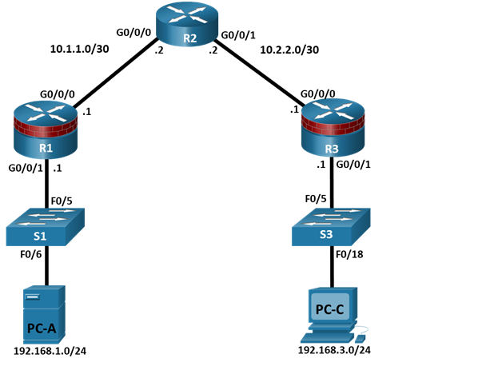
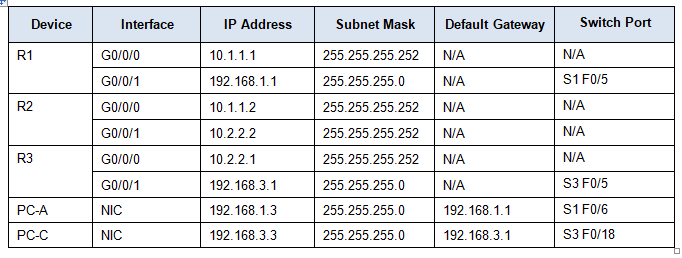

#                Лабораторная работа № 1 
## Настройка Безопасного Административного Доступа
## Представлена следующая топология

## Таблица IP-адресации.

## Цели
### Часть 1 :Настройка основных параметров устройств
+ Подключите сеть, как показано в топологии.
+ Настройте базовую IP-адресацию для маршрутизаторов и ПК.
+ Настройте маршрутизацию OSPF.
+ Настройка хостов ПК
+ Проверьте подключение между хостами и маршрутизаторами.
### Часть 2 :Настройка и шифрование паролей на маршрутизаторах R1 и R3
+ Настройте зашифрованный пароль для консоли, вспомогательного порта и виртуальных линий доступ
+  Шифрование паролей с открытым текстом
+  Настройка баннера с предупреждающим сообщением
### Часть 3 :Настройка повышенной безопасности имени пользователя и пароля на маршрутизаторах R1 и R3
+ Создание новых учетных записей пользователей
+ Войдите в систему, используя учетные записи пользователей
### Часть 4 :Настройка SSH-сервера на маршрутизаторах R1 и R3
+ Настройка доменного имени
+ Генерировать ключ шифрования RSA
+ Настройка и проверка конфигураций SSH
### Теоретическая часть

Маршрутизатор является важнейшим компонентом любой сети. Он управляет перемещением данных в сеть и из нее, а также между устройствами внутри сети. Особенно важно защитить сетевые маршрутизаторы, поскольку отказ маршрутизирующего устройства может сделать недоступными отдельные участки сети или всю сеть. Контроль доступа к маршрутизаторам и включение отчетов о маршрутизаторах имеют решающее значение для сетевой безопасности и должны быть частью всеобъемлющей политики безопасности.
В этой лабораторной работе вы создадите сеть с несколькими маршрутизаторами и настроите маршрутизаторы и хосты. Используйте различные инструменты CLI для обеспечения локального и удаленного доступа к маршрутизаторам, анализа потенциальных уязвимостей и принятия мер по их устранению. Включите управленческую отчетность для отслеживания изменений конфигурации маршрутизатора.
Примечание: Маршрутизаторы, используемые в практических лабораториях, - это Cisco 4221 с Cisco IOS XE версии 16.9.6 (изображение universalk9). Коммутаторы, используемые в лабораториях, - это Cisco Catalyst 2960+ с Cisco IOS версии 15.2 (7) (изображение lanbasek9). Можно использовать другие маршрутизаторы, коммутаторы и версии Cisco IOS. В зависимости от модели и версии Cisco IOS доступные команды и выдаваемый результат могут отличаться от того, что показано в лабораторных условиях.Обратитесь к Сводной таблице интерфейса маршрутизатора в конце лабораторной работы для получения правильных идентификаторов интерфейса.
Примечание: Прежде чем начать, убедитесь, что маршрутизаторы и коммутаторы были удалены и не имеют конфигураций запуска.

### Необходимые Ресурсы

+ 3 маршрутизатора (Cisco 4221 с универсальным образом Cisco XERelease 16.9.6 или сопоставимым с лицензией на пакет технологий безопасности)
+ 2 коммутатора (Cisco 2960+ с изображением Cisco IOS версии 15.2 (7) lanbasek9 или аналогичным)
+ 2 ПК (ОС Windows с установленной программой терминальной эмуляции, такой как PuTTY или Tera Term)
+ Консольные кабели для конфигурирования сетевых устройств CISCO
+ Кабели Ethernet , как показано в топологии

### Инструкции  

### Часть 1 :Настройка основных параметров устройств  

В этой части настройте топологию сети и настройте основные параметры, такие как IP-адреса интерфейса  

#### Шаг 1: Подключите кабель к сети.  
Подсоедините устройства, как показано на схеме топологии, и при необходимости подключите кабель  

#### Шаг 2: Настройте основные параметры для каждого маршрутизатора.  
a. Подключите консоль к маршрутизатору и включите привилегированный режим EXEC.  
Router>enable  
Router# configure terminal  
b. Настройте имена узлов, как показано в топологии  
R1(config)# hostname R1  
c. Настройте IP-адреса интерфейса, как показано в таблице IP-адресации.  
R1(config)# interface g0/0/0  
R1(config-if)# ip address 10.1.1.1 255.255.255.0  
R1(config-if)# no shutdown  

R1(config)# interface g0/0/1  
R1(config-if)# ip address 192.168.1.1 255.255.255.0  
R1(config-if)# no shutdown  

d. Чтобы маршрутизатор не пытался перевести неправильно введенные команды, как если бы они были именами хостов, отключите поиск DNS. R1 показан здесь в качестве примера.  
R1(config)# no ip domain-lookup  
#### Шаг 3: Настройте маршрутизацию OSPF на маршрутизаторах.  

a. Используйте команду ospf маршрутизатора в режиме глобальной конфигурации, чтобы включить OSPF на R1.  

R1(config)# router ospf 1  

b. Настройте сетевые инструкции для сетей на R1. Используйте идентификатор области, равный 0.  

R1(config-router)# network 192.168.1.0 0.0.0.255 area 0  
R1(config-router)# network 10.1.1.0 0.0.0.3 area 0  

c. Настройте OSPF на R2 и R3.  

R2(config)#router ospf 1  
R2(config-router)#network 10.1.1.0 0.0.0.3 area 0  
R2(config-router)#network 10.2.2.0 0.0.0.3 area 0  

R3(config)#router ospf 1  
R3(config-router)#network 10.2.2.0 0.0.0.3 area 0  
R3(config-router)#network 192.168.3.0 0.0.0.255 area 0  

d. Выполните команду passive-interface, чтобы изменить интерфейс G0/0/1 на R1 и R3 на пассивный  

R1(config)# router ospf 1  
R1(config-router)# passive-interface g0/0/1  
R3(config)# router ospf 1  
R3(config-router)# passive-interface g0/0/1  

#### Шаг 4: Проверьте соседей OSPF и информацию о маршруте.  
a. Выполните команду show ip ospf neighbor, чтобы убедиться, что каждый маршрутизатор перечисляет другие маршрутизаторы в сети в качестве соседей.  
R1# show ip ospf neighbor  

Neighbor ID     Pri   State           Dead Time   Address         Interface
10.2.2.2          1   FULL/BDR        00:00:37    10.1.1.2        GigabitEthernet0/0/0  
b. Выполните команду show ip-route, чтобы убедиться, что все сети отображаются в таблице маршрутизации на всех маршрутизаторах.  
R1# show ip route  
Codes: L - local, C - connected, S - static, R - RIP, M - mobile, B - BGP
       D - EIGRP, EX - EIGRP external, O - OSPF, IA - OSPF inter area
       N1 - OSPF NSSA external type 1, N2 - OSPF NSSA external type 2
       E1 - OSPF external type 1, E2 - OSPF external type 2
       i - IS-IS, su - IS-IS summary, L1 - IS-IS level-1, L2 - IS-IS level-2
       ia - IS-IS inter area, * - candidate default, U - per-user static route
       o - ODR, P - periodic downloaded static route, H - NHRP, l - LISP
       a - application route
       + - replicated route, % - next hop override, p - overrides from PfR  

Gateway of last resort is not set  

         10.0.0.0/8 is variably subnetted, 3 subnets, 2 masks  
C        10.1.1.0/30 is directly connected, GigabitEthernet0/0/0  
L        10.1.1.1/32 is directly connected, GigabitEthernet0/0/0  
O        10.2.2.0/30 [110/2] via 10.1.1.2, 00:01:11, GigabitEthernet0/0/0  
      192.168.1.0/24 is variably subnetted, 2 subnets, 2 masks  
C        192.168.1.0/24 is directly connected, GigabitEthernet0/0/1  
L        192.168.1.1/32 is directly connected, GigabitEthernet0/0/1  
O     192.168.3.0/24 [110/3] via 10.1.1.2, 00:01:07, GigabitEthernet0/0/0   

#### Шаг 5: Настройте параметры IP-адреса хоста ПК.  
Настройте статический IP-адрес, маску подсети и шлюз по умолчанию для PCA и PCC, как показано в таблице IP-адресации.
#### Шаг 6: Проверьте подключение между PC-A и PC-C.
a. Пинг от R1 до R3.  
Если запросы не завершились успешно, устраните неполадки в основных конфигурациях устройства, прежде чем продолжить.  
b. Выполните пинг с PC-A в локальной сети R1 на PCC в локальной сети R3.
Если запросы не завершились успешно, устраните неполадки в основных конфигурациях устройства, прежде чем продолжить.  

Примечание: Если вы можете выполнить пинг с ПК-A на ПК-C, вы продемонстрировали, что маршрутизация OSPF настроена и функционирует правильно. Если вы не можете выполнить поиск, но интерфейсы устройств подключены, а IP-адреса указаны правильно, используйте команды show run, show ip ospf neighbor и show ip route, чтобы помочь определить проблемы, связанные с протоколом маршрутизации. 
#### Шаг 7: Сохраните базовую текущую конфигурацию для каждого маршрутизатора.

Сохраните базовую текущую конфигурацию маршрутизаторов в виде текстовых файлов на вашем компьютере.Эти текстовые файлы можно использовать для восстановления конфигураций позже в лаборатории.  
### Часть 2: Настройка и шифрование паролей на маршрутизаторах R1 и R3  
В этой части вы будете выполнять:
+ Настройку зашифрованных паролей.
+ Настройте предупреждающий баннер alogin.
+ Настройте повышенную безопасность имени пользователя и пароля.
+ Настройте повышенную безопасность виртуального входа в систему.  
Примечание:
Выполняйте все задачи как на R1, так и на R3. Процедуры и выходные данные для R1 показаны здесь.  

#### Шаг 1: Настройте зашифрованные пароли на маршрутизаторах R1 и R3.
a. Настройте параметр включить секретный зашифрованный пароль на обоих маршрутизаторах. Используйте алгоритм хеширования типа 9 (SCRYPT).  
R1(config)# enable algorithm-type scrypt secret cisco12345  
## Вопрос:
## Как настройка секретного пароля включения помогает защитить маршрутизатор от взлома в результате атаки?
b. Используйте команду security passwords, чтобы установить минимальную длину пароля в 10 символов.  
R1(config)# security passwords min-length 10  
#### Шаг 2: Настройте базовую консоль, вспомогательный порт и виртуальные линии доступа.
Примечание:
Пароли в этой задаче задаются минимум из 10 символов, но они относительно просты для удобства выполнения лабораторной работы. В производственной сети рекомендуется использовать более сложные пароли.  
a. Настройте пароль консоли и включите вход для маршрутизаторов. Для дополнительной безопасности команда exec-timeout приводит к выходу из системы после 5 минут бездействия. Синхронная команда ведения журнала предотвращает прерывание ввода команды сообщениями консоли.
Примечание:  
Чтобы избежать повторяющихся входов в систему во время этой лабораторной работы, команда exec-timeout может быть установлена в 0 0, что предотвращает ее истечение. Однако это не считается хорошей практикой обеспечения безопасности.

R1(config)# line console 0  
R1(config-line)# password ciscocon  
R1(config-line)# exec-timeout 5 0  
R1(config-line)# login   
R1(config-line)# logging synchronous  

## Вопрос:Когда вы настраивали пароль для строки консоли, какое сообщение отображалось?

b. Настройте новый пароль ciscoconpass для консоли.  
c. Настройте пароль для порта AUX для маршрутизатора R1.

R1(config)# line aux 0
R1(config-line)# password ciscoauxpass
R1(config-line)# exec-timeout 5 0
R1(config-line)# login

d. Telnet от R2 до R1.

R2>telnet 10.1.1.1

## Вопрос: Смогли ли вы войти в систему? Объяснять.
## Какие сообщения были выведены на экран?  

e. Настройте пароль в строках vty для маршрутизатора R1.  
R1(config)# line vty 0 4
R1(config-line)# password ciscovtypass
R1(config-line)# exec-timeout 5 0
R1(config-line)# transport input telnet
R1(config-line)# login  

f. Снова подключите Telnet от R2 к R1.  
## Вопрос:
## Смогли ли вы войти в систему на этот раз?

g. Войдите в привилегированный режим EXEC и выполните команду show run.

## **Можете ли вы прочитать секретный пароль включения? Объяснять.**
## **Введите свои ответы здесь.**
## **Можете ли вы прочитать пароли консоли, aux и vty? Объяснять.**

### Шаг 3: Шифрование паролей с открытым текстом

a. Используйте команду service password-encryption для шифрования паролей консоли, aux и vty.
R1(config)# service password-encryption

b. Выполните команду show run.
## Можете ли вы прочитать пароли консоли, aux и vty? Объяснять.
## Введите свои ответы здесь.
## На каком уровне (номер) зашифрован пароль enable secret по умолчанию?
## Введите свои ответы здесь.
## На каком уровне (номер) зашифрованы другие пароли?
## Введите свои ответы здесь.
## Какой уровень шифрования труднее взломать. Объяснять.

### Шаг 4: Настройте предупреждающее сообщение для отображения перед входом в систему.
a. Настройте предупреждение для неавторизованных пользователей с помощью баннера "Сообщение дня" (MOTD) с помощью команды banner motd. Когда пользователь подключается к одному из маршрутизаторов, перед запросом на вход появляется баннер MOTD. В этом примере знак доллара ($) используется для начала и завершения сообщения.
R1(config)# banner motd $Unauthorized access strictly prohibited!$
R1(config)# exit
b. Выполните команду show run.
## Вопрос:
## Во что преобразуется значение $ в выходных данных?
c. Снова подключите Telnet к R1 из R2. Обратите внимание на баннер MOTD.
d. Повторите часть настройки предыдущих шагов на маршрутизаторе R3.  
## Часть 3. Настройка усиленной защиты имени пользователя и пароля на маршрутизаторах R1 и R3
### Шаг 1: Изучите параметры для команды username.
Открыть окно конфигурации
В режиме глобальной конфигурации введите следующую команду:
R1(config)# username user01 algorithm-type ?
## Вопрос: Какие варианты доступны?  
### Шаг 2: Создайте новую учетную запись пользователя с секретным паролем.
a. Создайте новую учетную запись пользователя с помощью хеширования SCRYPT для шифрования пароля.
R1(config)# username user01algorithm-type scrypt secret user01pass
b. Выйдите из режима глобальной конфигурации и сохраните свою конфигурацию.
c. Отобразите текущую конфигурацию.
## Вопрос:
## Какой метод хеширования используется для пароля?
### Шаг 3: Протестируйте новую учетную запись, войдя в консоль.
a. Настройте строку консоли на использование локально определенных учетных записей для входа.
R1(config)# line console 0
R1(config-line)# login local
R1(config-line)# end
R1# exit
b. Выйдите на начальный экран маршрутизатора, на котором отображается: R1 con0 теперь доступен, нажмите RETURN, чтобы начать.
c. Войдите в систему, используя ранее определенное имя пользователя user01 и пароль user01pass.
## Вопрос:
## В чем разница между входом в консоль сейчас и ранее?
## Введите свои ответы здесь.
d. После входа в систему выполните команду show run.
## Вопрос:
## Смогли ли вы отдать команду? Объяснять.
## Введите свои ответы здесь.
e. Войдите в привилегированный режим EXEC с помощью команды enable.
## Вопрос:
## Вам было предложено ввести пароль? Объяснять.
## Часть 4: Настройка SSH-сервера на маршрутизаторах R1 и R3  
В этой части используйте интерфейс командной строки для настройки безопасного управления маршрутизатором с использованием SSH вместо Telnet. Secure Shell (SSH) - это сетевой протокол, который устанавливает безопасное соединение с эмуляцией терминала к маршрутизатору или другому сетевому устройству. SSH шифрует всю информацию, которая передается по сетевому каналу, и обеспечивает аутентификацию удаленного компьютера. SSH быстро заменяет Telnet в качестве предпочтительного инструмента удаленного входа для сетевых профессионалов.
Примечание: Чтобы маршрутизатор поддерживал SSH, он должен быть настроен на локальную аутентификацию (службы AAA или имя пользователя) или аутентификацию по паролю. В этой задаче вы настраиваете имя пользователя SSH и локальную аутентификацию.
### Шаг 1: Настройте доменное имя.
Открыть окно конфигурации
Войдите в режим глобальной конфигурации и задайте доменное имя.
R1# conf t
R1(config)# ip domain-name netsec.com
### Шаг 2: Настройте привилегированного пользователя для входа в систему с помощью SSH-клиента.
a. Используйте команду username, чтобы создать идентификатор пользователя с максимально возможным уровнем привилегий и секретным паролем.
R1(config)# username admin privilege 15 algorithm-type scrypt secret cisco12345
Примечание: Имена пользователей по умолчанию не чувствительны к регистру.
b. Выйдите на начальный экран входа в систему маршрутизатора. Войдите в систему с именем пользователя admin и соответствующим паролем.
## Вопрос:
## Какой была подсказка маршрутизатора после того, как вы ввели пароль?  
Шаг 3: Настройте входящие линии vty.
Укажите уровень привилегий 15, чтобы пользователь с наивысшим уровнем привилегий (15) по умолчанию переходил в режим привилегированного выполнения при доступе к строкам vty. Другие пользователи по умолчанию будут работать в режиме user EXEC. Используйте учетные записи локальных пользователей для обязательного входа в систему и проверки и принимайте только SSH-соединения.  
R1(config)# line vty 0 4
R1(config-line)# privilege level 15
R1(config-line)# login local
R1(config-line)# transport input ssh
R1(config-line)# exit
Примечание: Локальная команда входа в систему должна была быть настроена на предыдущем шаге. Он включен здесь, чтобы предоставить все команды, если вы делаете это в первый раз.
Примечание: Если вы добавите ключевое слово telnet в команду ввода транспорта, пользователи смогут входить в систему с помощью Telnet, а также SSH, однако маршрутизатор будет менее безопасным. Если указан только SSH, на подключающемся хосте должен быть установлен SSH-клиент.
### Шаг 4: Сотрите существующие пары ключей на маршрутизаторе.
R1(config)# crypto key zeroize rsa
Примечание: Если ключи не существуют, вы можете получить следующее сообщение: % В конфигурации не найдены ключи RSA подписи.
### Шаг 5: Сгенерируйте пару ключей шифрования RSA для маршрутизатора.
Маршрутизатор использует пару ключей RSA для аутентификации и шифрования передаваемых данных SSH.
a. Настройте ключи RSA на 1024 для количества бит модуля. Значение по умолчанию равно 512, а диапазон - от 360 до 2048.  

R1(config)# crypto key generate rsa general-keys modulus 1024
The name for the keys will be: R1.netsec.com

% The key modulus size is 1024 bits
% Generating 1024 bit RSA keys, keys will be non-exportable...[OK]

R1(config)#
*Dec 16 21:24:16.175: %SSH-5-ENABLED: SSH 1.99 has been enabled  

a. Выполните команду ip ssh версии 2, чтобы принудительно использовать SSH версии

R1(config)# ip ssh version 2
R1(config)# exit  

Примечание: Подробности о методах шифрования рассматриваются в более позднем модуле.

### Шаг 6: Проверьте конфигурацию SSH.
a. Используйте команду show ip ssh, чтобы просмотреть текущие настройки  
R1# show ip ssh  

b. Заполните следующую информацию на основе выходных данных команды show ip ssh.
SSH version enabled:
Type your answers here.
Authentication timeout:
Type your answers here.
Authentication retries:

### Шаг 7: Настройте тайм-ауты SSH и параметры аутентификации.
a. Тайм-ауты SSH по умолчанию и параметры аутентификации можно изменить, чтобы они были более строгими, используя следующие команды.
R1(config)# ip ssh time-out 90
R1(config)# ip ssh authentication-retries 2
b. Используйте команду show ip ssh, чтобы просмотреть текущие настройки.
c. Сохраните running-config в startup-config.
R1# copy running-config startup-config
d. Повторите часть настройки предыдущих шагов на маршрутизаторе R3.
### Шаг 8: Проверьте подключение по SSH к R1 с ПК-A.
a. С ПК подключитесь по SSH к маршрутизатору R1 с помощью программного обеспечения для эмуляции терминала, выбрав опцию SSH и указав IP-адрес R1. Подтвердите, что вы будете доверять хосту (R1), когда появится запрос в предупреждении о безопасности.
b. При появлении запроса введите имя пользователя и пароль администратора cisco12345.
c. В командной строке R1 privileged EXEC введите команду show users.
R1# show users
## Какие пользователи подключены к маршрутизатору R1 в это время?
## Введите свои ответы здесь.
d. Закройте окно сеанса SSH.
e. Попробуйте открыть сеанс Telnet для вашего маршрутизатора с ПК-A.  
## Удалось ли вам открыть сеанс Telnet? Объяснять.
## Введите свои ответы здесь.
f. Откройте сеанс PuTTY SSH для маршрутизатора с ПК-A. Введите имя пользователя user01 и пароль user01pass в окне PuTTY, чтобы попытаться подключиться к пользователю, у которого нет уровня привилегий 15.
## Если вы смогли войти в систему, что это было за приглашение?
## Введите свои ответы здесь.
g. Используйте команду enable для входа в режим privilege EXEC и введите секретный пароль enable cisco12345.
Закрыть окно настройки
	
## Вопросы.
## 1. Объясните важность обеспечения безопасности доступа к маршрутизатору и мониторинга сетевых устройств.
## Введите свои ответы здесь.
## 2. Какие преимущества имеет SSH перед Telnet?

## Сводная таблица Интерфейса маршрутизатора

