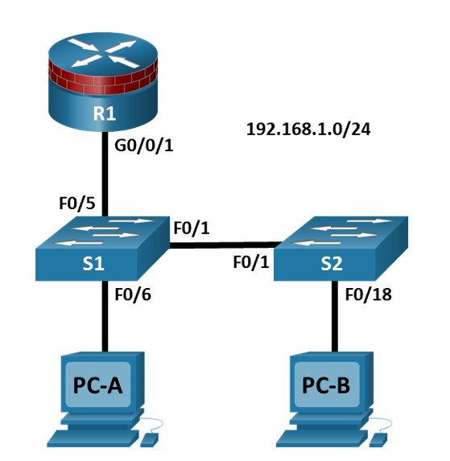
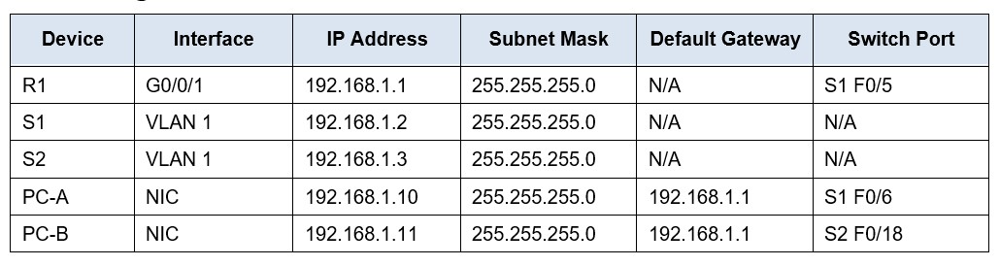
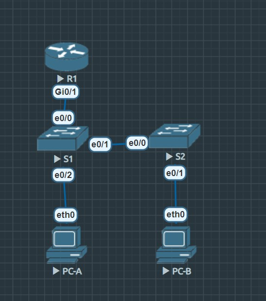
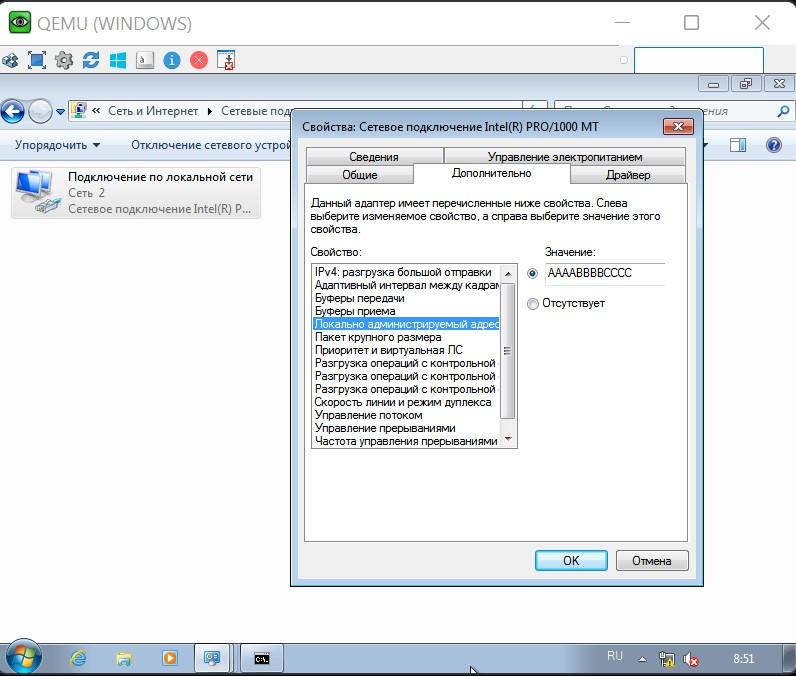

# Лабораторная работ № 6    
# Настройка безопасности STP  
## Представлена следующая топология     
   
## Таблица IP-адресации.    
   
# Цели.    
## Часть 1: Настройка Основных параметров Коммутатора     
 Постройте топологию.    
 Настройте имя хоста, IP-адрес и пароли доступа.    
## Часть 2. Настройка защищенных магистральных портов( Secure Trunks Ports)    
 Настройте режим магистрального порта.    
 Измените собственную VLAN(native) для магистральных портов.   
 Проверьте конфигурацию магистрали(trunk).    
 Отключите транкинг.    
## Часть 3: Защита От STP-Атак    
 Включите PortFast и BPDU guard.  
 Проверьте защиту BPDU guard.     
 Включите root guard.    
 Включить loop guard.  

## Часть 4: Настройка безопасности портов и отключение неиспользуемых портов      
 Настройте и проверьте безопасность портов.     
 Отключите неиспользуемые порты.    
 Переместите порты из VLAN 1 по умолчанию в альтернативную VLAN.   
 Настройте пограничную функцию PVLAN на порту.      
## Теоретическая часть     
Инфраструктура уровня 2 состоит в основном из взаимосвязанных коммутаторов Ethernet. Большинство устройств конечного пользователя, таких как компьютеры, принтеры, IP-телефоны и другие хосты, подключаются к сети через коммутаторы доступа уровня 2. В результате коммутаторы могут представлять угрозу безопасности сети. Подобно маршрутизаторам, коммутаторы подвергаются атакам со стороны злонамеренных внутренних пользователей. Программное обеспечение коммутатора Cisco IOS предоставляет множество функций безопасности, специфичных для функций и протоколов коммутатора.    
В этой лабораторной работе вы настроите различные меры защиты коммутатора, включая защиту портов доступа и функции протокола связующего дерева (STP), такие как защита BPDU и защита root.    
Примечание: Маршрутизаторы, используемые в практических лабораториях CCNA, - это Cisco 4221 с Cisco IOS XE версии 16.9.6 (изображение universalk9). В лабораториях используются коммутаторы Cisco Catalyst 2960+ с Cisco IOS версии 15.2 (7) (изображение lanbasek9). Можно использовать другие маршрутизаторы, коммутаторы и версии Cisco IOS. В зависимости от модели и версии Cisco IOS доступные команды и выдаваемый результат могут отличаться от того, что показано в лабораторных условиях. Правильные идентификаторы интерфейсов приведены в Сводной таблице интерфейса маршрутизатора в конце лабораторной работы.    
Примечание: Прежде чем начать, убедитесь, что маршрутизаторы и коммутаторы были удалены и не имеют конфигураций запуска.    
## Необходимые Ресурсы     
Необходимые Ресурсы  
 1 Маршрутизатор (Cisco 4221 с универсальным образом Cisco XE версии 16.9.6 или сопоставимым с лицензией на пакет технологий безопасности)  
 2 коммутатора (Cisco 2960+ с изображением Cisco IOS версии 15.2(7) lanbasek9 или аналогичным)  
 2 ПК (ОС Windows с установленной программой эмуляции терминала, такой как PuTTY или Tera Term)   
 Консольные кабели для настройки сетевых устройств Cisco  
 Кабели Ethernet , как показано в топологии 
# Выполнение лабораторной работы № 6  
Для выполнения данной лабораторной работы 
Данная топология была собрана на лабораторном(программном) стенде EVE-NG.  
В дальнейшем настройка сетевых устройств будет осуществляться согласно схемы собранной на стенде.     

## Часть 1: Настройка Основных параметров Коммутатора  
В части 1 вы настроите топологию сети и настроите основные параметры, такие как имена хостов, IP-адреса и пароли доступа к устройствам.  
### Шаг 1: Подключите сеть, как показано в топологии.  
Подсоедините устройства, как показано на схеме топологии, и при необходимости подключите кабель.  
### Шаг 2: Настройте основные параметры для маршрутизатора и каждого коммутатора.  
Выполните все задачи на R1, S1 и S2. Процедура для S1 показана здесь в качестве примера.  
Открыть окно конфигурации   
Настройте имена хостов, как показано в топологии.  
Настройте IP-адреса интерфейса, как показано в таблице IP-адресации. Следующая конфигурация отображает интерфейс управления VLAN 1 на S1:  
В данной лабораторной работе также в целях сетевой безопасности сделать не VLAN 1 а VLAN 5.  
S1(config)# interface vlan 5    
S1(config-if)# ip address 192.168.5.2 255.255.255.0     
S1(config-if)# no shutdown    
Также настраиваем R1 под VLAN5    
R1(config)# interface GigabitEthernet0/1.5    
R1(config-subif)# ip address 192.168.5.1 255.255.255.0    
R1(config-subif)# encapsulation dot1Q 5  
Предотвратите попытки маршрутизатора или коммутатора перевести неправильно введенные команды, отключив поиск DNS.  
S1 показан здесь в качестве примера    
S1(config)# no ip domain-lookup    
HTTP-доступ к коммутатору включен по умолчанию. Предотвратите доступ по протоколу HTTP, отключив HTTP-сервер и HTTP secure server.   
S1(config)# no ip http server   
S1(config)# no ip http secure-server    
### Примечание: Коммутатор должен иметь криптографический образ IOS для поддержки команды ip http secure-server. HTTP-доступ к маршрутизатору по умолчанию отключен.  
Настройте параметр enable secret password.    
S1(config)# enable algorithm-type scrypt secret cisco12345    
Настройте пароль консоли.    
S1(config)# line console 0    
S1(config-line)# password ciscoconpass    
S1(config-line)# exec-timeout 5 0  
S1(config-line)# login    
S1(config-line)# logging synchronous    
### Шаг 3: Настройте параметры IP-адреса хоста ПК.  
Настройте статический IP-адрес, маску подсети и шлюз по умолчанию для PCA и PCB, как показано в таблице адресации.  
### Шаг 4: Проверьте базовое сетевое подключение.     
a. Отправьте Ping-запрос от PCA и PCB к интерфейсу R1 G0/0/1 по IP-адресу 192.168.5.1  
PC-A> ping 192.168.5.1  

84 bytes from 192.168.5.1 icmp_seq=1 ttl=255 time=1.779 ms  
84 bytes from 192.168.5.1 icmp_seq=2 ttl=255 time=1.735 ms  
84 bytes from 192.168.5.1 icmp_seq=3 ttl=255 time=1.951 ms  
84 bytes from 192.168.5.1 icmp_seq=4 ttl=255 time=1.720 ms  
84 bytes from 192.168.5.1 icmp_seq=5 ttl=255 time=1.728 ms  

PC-A>  

PC-B> ping 192.168.5.1  

84 bytes from 192.168.5.1 icmp_seq=1 ttl=255 time=2.866 ms  
84 bytes from 192.168.5.1 icmp_seq=2 ttl=255 time=2.145 ms  
84 bytes from 192.168.5.1 icmp_seq=3 ttl=255 time=2.082 ms  
84 bytes from 192.168.5.1 icmp_seq=4 ttl=255 time=2.119 ms  
84 bytes from 192.168.5.1 icmp_seq=5 ttl=255 time=2.247 ms  

PC-B>  

b. Отправьте Ping-запрос от PC-A к PC-B.   

PC-A> ping 192.168.5.11  

84 bytes from 192.168.5.11 icmp_seq=1 ttl=64 time=0.720 ms  
84 bytes from 192.168.5.11 icmp_seq=2 ttl=64 time=0.855 ms  
84 bytes from 192.168.5.11 icmp_seq=3 ttl=64 time=0.906 ms  
84 bytes from 192.168.5.11 icmp_seq=4 ttl=64 time=0.839 ms  
84 bytes from 192.168.5.11 icmp_seq=5 ttl=64 time=0.847 ms  

### Шаг 5: Сохраните основные конфигурации для маршрутизатора и обоих коммутаторов.    
Сохраните текущую конфигурацию в конфигурации запуска из приглашения привилегированного режима EXEC.    
S1# copy running-config startup-config    
## Часть 2. Настройка Защищенных Магистральных портов     
В этой части вы настроите магистральные порты, измените собственную VLAN для магистральных портов и проверите конфигурацию магистрали.    
Защита магистральных портов может помочь предотвратить атаки с перескакиванием VLAN. Лучший способ предотвратить базовую атаку с перескакиванием VLAN - это явно   отключить транкинг на всех портах, кроме портов, которые специально требуют транкинга. На требуемых портах транкинга отключите переговоры DTP (auto trunking) и включите транкинг вручную. Если транкинг для интерфейса не требуется, настройте порт в качестве порта доступа. Это отключает транкинг в интерфейсе.  
Примечание: Задачи должны выполняться на S1 или S2, как указано.   

### Шаг 1: Настройте S1 в качестве корневого коммутатора.  
Для целей этой вкладки S2 в настоящее время является корневым мостом. Вы настроите S1 в качестве корневого моста, изменив уровень приоритета идентификатора моста.  
a. Из консоли на S1 войдите в режим глобальной конфигурации.    
b. Приоритет по умолчанию для S1 и S2 равен 32769 (32768 + 1 с расширением системного идентификатора). Установите приоритет S1 равным 0, чтобы он стал корневым коммутатором.  
S1(config)# spanning-tree vlan 5 priority 0  
S1(config)# exit  
### Примечание: Вы также можете использовать команду spanning-tree vlan 5 root primary, чтобы сделать S1 корневым коммутатором для VLAN 5.  
c. Выполните команду show spanning-tree , чтобы убедиться, что S1 является корневым мостом, чтобы увидеть используемые порты и их статус.    
S1#show spanning-tree  
VLAN0005  
  Spanning tree enabled protocol rstp  
  Root ID    Priority    5  
             Address     aabb.cc00.5000  
             This bridge is the root  
             Hello Time   2 sec  Max Age 20 sec  Forward Delay 15 sec  

  Bridge ID  Priority    5      (priority 0 sys-id-ext 5)  
             Address     aabb.cc00.5000  
             Hello Time   2 sec  Max Age 20 sec  Forward Delay 15 sec  
             Aging Time  300 sec  

Interface           Role Sts Cost      Prio.Nbr Type  

Et0/0               Desg FWD 100       128.1    Shr  
Et0/1               Desg FWD 100       128.2    Shr  
Et0/2               Desg FWD 100       128.3    Shr Edge  
Et0/3               Desg FWD 100       128.4    Shr  

S2#show spanning-tree  
VLAN0005  
  Spanning tree enabled protocol rstp  
  Root ID    Priority    5  
             Address     aabb.cc00.5000  
             Cost        100  
             Port        1 (Ethernet0/0)  
             Hello Time   2 sec  Max Age 20 sec  Forward Delay 15 sec  

  Bridge ID  Priority    32773  (priority 32768 sys-id-ext 5)  
             Address     aabb.cc00.7000  
             Hello Time   2 sec  Max Age 20 sec  Forward Delay 15 sec  
             Aging Time  300 sec  

Interface           Role Sts Cost      Prio.Nbr Type  
------------------- ---- --- --------- -------- --------------------------------  
Et0/0               Root FWD 100       128.1    Shr  
Et0/1               Desg FWD 100       128.2    Shr Edge  

### Вопрос:    
### Каков приоритет S1?   
Приоритет коммутатора S1 равен нулю.  
"This bridge is the root" -данный коммутатор является корневым.  
### Какие порты используются и каков их статус?     
Коммутатор S1 -все 4 порта являются назначенными в режиме пересылки  
Также порты находятся в режиме shared (half-duplex) - полудуплекс либо передает либо получает.  
Et0/2 - является пограничным портом(к нему подключено конечное устройство)  
### Шаг 2: Настройте магистральные порты на S1 и S2.    
a. Настройте порт e0/1 на S1 в качестве магистрального порта.    
S1(config)#interface Ethernet0/1  
S1(config-if)#switchport trunk encapsulation dot1q  
S1(config-if)#switchport mode trunk  
S1(config-if)#switchport trunk allowed vlan 5 (привязываем порт к VLAN 5)  
### Примечание: При выполнении этой лабораторной работы с коммутатором 3560 пользователь должен сначала ввести команду switchport trunk encapsulation dot1q.      
Выводим данные по транкам  

S1#show interfaces trunk  
Port        Mode             Encapsulation  Status        Native vlan  
Et0/0       on               802.1q         trunking      59  
Et0/1       on               802.1q         trunking      59  
  
Port        Vlans allowed on trunk  
Et0/0       5 
Et0/1       5  

Port        Vlans allowed and active in management domain  
Et0/0       5   
Et0/1       5  

Port        Vlans in spanning tree forwarding state and not pruned  
Et0/0       5  
Et0/1       5  

b. Настройте порт e0/0 на S2 в качестве магистрального порта.    
S2(config)#interface Ethernet0/0  
S2(config-if)#switchport trunk encapsulation dot1q  
S2(config-if)#switchport mode trunk  
S2(config-if)#switchport trunk allowed vlan 5 (привязываем порт к VLAN 5)  
  
Выводим данные по транкам  
S2#show interfaces trunk  

Port        Mode             Encapsulation  Status        Native vlan  
Et0/0       auto             802.1q         trunking      59  
  
Port        Vlans allowed on trunk  
Et0/0       5  

Port        Vlans allowed and active in management domain  
Et0/0       5  

Port        Vlans in spanning tree forwarding state and not pruned  
Et0/0       5  

### Шаг 3: Измените собственную VLAN для магистральных портов на S1 и S2.    
a. Изменение собственной VLAN для магистральных портов на неиспользуемую VLAN помогает предотвратить атаки с перескакиванием VLAN.    
Вопрос:  
Из выходных данных команды show interfaces trunk на предыдущем шаге, какова текущая собственная VLAN для интерфейса магистрали S1 E0/1?   
VLAN 5  
b. Установите для собственной VLAN на магистральном интерфейсе S1 e0/1 значение неиспользуемой VLAN 59.    
S1(config)#interface Ethernet0/0  -встроенной vlan присваеваем номер нерабочей vlan 59 (только для транка)  
S1(config-if)#switchport trunk native vlan 59  
S1(config-if)#exit  
c. Через короткий промежуток времени должно появиться следующее сообщение:  
*Jun 29 11:48:07.345: %CDP-4-NATIVE_VLAN_MISMATCH: Native VLAN mismatch discovered on Ethernet0/1 (59), with S2 Ethernet0/0 (1).  
     
Что означает это сообщение?  
Обнаружено несоответствие собственной VLAN коммутатора S1  и коммутатора S2  
Для того чтобы не выводилось данное сообщение .Необходимо установить такое же значение неиспользуемой VLAN 59 для коммутатора S2    
d. Установите для собственной VLAN на магистральном интерфейсе S2 e0/0 значение VLAN 59.    
S2(config)# interface e0/0    
S2(config-if)# switchport trunk native vlan 59    
S2(config-if)# end      
### Шаг 4: Предотвратите использование DTP на S1 и S2.    
S2(config)#interface range Ethernet0/0-3  отключаем DTP на портах.    
S2(config-if)#switchport nonegotiate     
S2(config-if)#exit    
Command rejected: Conflict between 'nonegotiate' and 'dynamic' status on this interface: Et0/0  - в данном случае отключить DTP на магистральном порту не получилось.     

Выводим данные по интерфейсам  

S2#sh interface switchport  
Name: Et0/0  
Switchport: Enabled  
Administrative Mode: dynamic auto  
Operational Mode: trunk  
Administrative Trunking Encapsulation: dot1q  
Operational Trunking Encapsulation: dot1q  
Negotiation of Trunking: On  
Access Mode VLAN: 1 (default)  
Trunking Native Mode VLAN: 59 (Inactive)  
Administrative Native VLAN tagging: enabled  
Voice VLAN: none  
Administrative private-vlan host-association: none  
Administrative private-vlan mapping: none  
Administrative private-vlan trunk native VLAN: none  
Administrative private-vlan trunk Native VLAN tagging: enabled   
Administrative private-vlan trunk encapsulation: dot1q  
Administrative private-vlan trunk normal VLANs: none  
Administrative private-vlan trunk associations: none  
Administrative private-vlan trunk mappings: none  
Operational private-vlan: none  
Trunking VLANs Enabled: 5  
Pruning VLANs Enabled: 2-1001  
Capture Mode Disabled  
Capture VLANs Allowed: ALL   

Protected: false  
Appliance trust: none  

Name: Et0/1  
Switchport: Enabled  
Administrative Mode: static access  
Operational Mode: static access  
Administrative Trunking Encapsulation: negotiate  
Operational Trunking Encapsulation: native  
Negotiation of Trunking: Off  
Access Mode VLAN: 5 (otus)  
Trunking Native Mode VLAN: 1 (default)  
Administrative Native VLAN tagging: enabled  
Voice VLAN: none  
Administrative private-vlan host-association: none  
Administrative private-vlan mapping: none  
Administrative private-vlan trunk native VLAN: none  
Administrative private-vlan trunk Native VLAN tagging: enabled  
Administrative private-vlan trunk encapsulation: dot1q  
Administrative private-vlan trunk normal VLANs: none  
Administrative private-vlan trunk associations: none  
Administrative private-vlan trunk mappings: none  
Operational private-vlan: none  
Trunking VLANs Enabled: ALL  
Pruning VLANs Enabled: 2-1001  
Capture Mode Disabled  
Capture VLANs Allowed: ALL  

Protected: false  
Appliance trust: none  

% Range command terminated because it failed on Ethernet0/0  

## Negotiation of Trunking: Off  - согласование транкинг - отключено  

### Шаг 7: Отключите транкинг на портах доступа S1.    
a. На S1 настройте e0/0, порт, к которому подключен R1, только в режиме доступа.    
Данный порт работает в режиме транкинга  
b. На S1 настройте e0/2, порт, к которому подключен PCA, только в режиме доступа.  
Переведем все оставшиеся порты в режим доступа  
S1(config)#interface range Ethernet0/2-3  
S1(config-if)#switchport access  
S1(config-if)#exit   
### Шаг 8: Отключите транкинг на портах доступа S2.  
На S2 настройте e0/1, порт, к которому подключена PCB, только в режиме доступа.    
Переведем все оставшиеся порты в режим доступа  
S2(config)#interface range Ethernet0/1-3  
S2(config-if)#switchport access  
S2(config-if)#exit  

## Часть 3: Защита От STP-Атак  
Сетевые злоумышленники надеются подделать свою систему или мошеннический коммутатор, который они добавляют в сеть, в качестве корневого моста в топологии, манипулируя параметрами корневого моста STP. Если порт, настроенный с помощью PortFast, получает BPDU, STP может перевести порт в состояние блокировки с помощью функции, называемой BPDU guard.    
Топология имеет только два коммутатора и не имеет избыточных путей, но STP все еще активен. В этой части вы включите функции безопасности коммутаторов, которые могут помочь уменьшить вероятность того, что злоумышленник манипулирует коммутаторами с помощью методов, связанных с STP.    
### Шаг 1: Включите portfast.    
PortFast настраивается на портах доступа, которые подключаются к одной рабочей станции или серверу, что позволяет им быстрее становиться активными           

a. Включите PortFast на портах доступа коммутаторов S1,S2.    

S1(config)#interface range Ethernet0/2  - Подключен PC-A  
S1(config-if)#spanning-tree portfast  
S1(config-if)#exit  
S2(config)#interface range Ethernet0/1 - Подключен PC-B  
S2(config-if)#spanning-tree portfast  

### Шаг 2: Включите защиту BPDU.    
BPDU guard - это функция, которая может помочь предотвратить несанкционированные коммутаторы и подмену портов доступа.   
a. Включите защиту BPDU на портах коммутаторов S1,S2 (все кроме транковых)         
S1(config-if)#interface range Ethernet0/2  
S1(config-if)#spanning-tree  bpduguard enable  
S2(config)#interface range Ethernet0/1   
S2(config-if-range)#spanning-tree bpduguard enable  
S2(config-if-range)#exit 
Примечание: PortFast и BPDU guard также можно включить глобально с помощью команд spanning-tree portfast default и spanning-tree portfast bpduguard в режиме глобальной конфигурации.   
Примечание: Защита BPDU может быть включена на всех портах доступа, для которых включена функция PortFast. Эти порты никогда не должны получать BPDU. BPDU guard лучше всего развертывать на портах, ориентированных на пользователя, чтобы предотвратить несанкционированное расширение сети коммутатора злоумышленником. Если порт включен с помощью BPDU guard и получает BPDU, он отключен и должен быть повторно включен вручную. На порту можно настроить тайм-аут, допускающий ошибку, чтобы он мог автоматически восстанавливаться по истечении указанного периода времени.   
b. Убедитесь, что защита BPDU настроена с помощью команды show spanning-tree interface e0/2 detail на S1.      
S1#show spanning-tree interface Ethernet0/2  

Vlan                Role Sts Cost      Prio.Nbr Type  
 
VLAN0005            Desg FWD 100       128.3    Shr Edge  
S1#show spanning-tree interface Ethernet0/2 detail  
 Port 3 (Ethernet0/2) of VLAN0005 is designated forwarding  
   Port path cost 100, Port priority 128, Port Identifier 128.3. 
   Designated root has priority 5, address aabb.cc00.5000  
   Designated bridge has priority 5, address aabb.cc00.5000  
   Designated port id is 128.3, designated path cost 0  
   Timers: message age 0, forward delay 0, hold 0  
   Number of transitions to forwarding state: 1  
   The port is in the portfast edge mode  
   Link type is shared by default  
   Bpdu guard is enabled  
   Root guard is enabled on the port 
   BPDU: sent 2422, received 0  
S1#  

### Шаг 3: Включите root guard.  
Root guard - это еще один вариант предотвращения несанкционированных переключений и подмены. Защита Root может быть включена на всех портах коммутатора, которые не являются корневыми портами. Обычно он включен только на портах, подключаемых к пограничным коммутаторам, где никогда не должен приниматься улучшенный BPDU. Каждый коммутатор должен иметь только один корневой порт, который является наилучшим путем к корневому коммутатору. 
a. Следующая команда настраивает root guard на интерфейсе S2 e0/1. Обычно это делается, если к этому порту подключен другой коммутатор. Root guard лучше всего развертывать на портах, которые подключаются к коммутаторам, которые не должны быть корневым мостом.  
S2(config)#interface Ethernet0/3  
S2(config-if-range)#spanning-tree guard root  
S2# show spanning-tree inconsistentports   

Name                 Interface              Inconsistency   

Number of inconsistent ports (segments) in the system : 0  
### Примечание: Root guard позволяет подключенному коммутатору участвовать в STP до тех пор, пока устройство не попытается стать root. Если root guard блокирует порт, последующее восстановление происходит автоматически. Порт возвращается в состояние пересылки, если вышестоящие BPDU останавливаются.   
Шаг 4: Включите loop guard.  
Функция STP loop guard обеспечивает дополнительную защиту от циклов пересылки уровня 2 (STP loops). Цикл STP создается, когда порт, блокирующий STP, в избыточной топологии ошибочно переходит в состояние пересылки. Обычно это происходит потому, что один из портов физически избыточной топологии (не обязательно порт, блокирующий STP) больше не принимает STP BPDU. Наличие всех портов в состоянии пересылки приведет к циклам пересылки. Если порт, включенный с помощью loop guard, перестает прослушивать BPDU с назначенного порта в сегменте, он переходит в состояние несогласованности цикла вместо перехода в состояние пересылки. Несогласованность цикла в основном блокирует, и трафик не пересылается. Когда порт снова обнаруживает BPDU, он автоматически восстанавливается, возвращаясь в состояние блокировки.    
a. Защита петли должна быть применена к не обозначенным портам. Таким образом, глобальная команда может быть настроена на некорневых коммутаторах.    
S2(config)# spanning-tree loopguard default     
b. Проверьте конфигурацию loopguard.     
S2# show spanning-tree summary   
Switch is in pvst mode    

Extended system ID           is enabled    
Portfast Default             is disabled    
PortFast BPDU Guard Default  is disabled    
Portfast BPDU Filter Default is disabled    
Loopguard Default            is enabled   
EtherChannel misconfig guard is enabled    
UplinkFast                   is disabled   
BackboneFast                 is disabled   
Configured Pathcost method used is short    

Name                   Blocking Listening Learning Forwarding STP Active   
  
VLAN0005                     0         0        0          3          3     
 

## Часть 4: Настройка безопасности портов и отключение неиспользуемых портов  
Коммутаторы могут быть подвержены переполнению CAM-таблицы, также известной как таблица MAC-адресов, атакам подмены MAC и несанкционированным подключениям к портам коммутатора. В этой задаче вы настроите безопасность порта, чтобы ограничить количество MAC-адресов, которые могут быть изучены на порту коммутатора, и отключить порт, если это число будет превышено.    

### Шаг 1: Настройте базовую безопасность порта PC-A e0/2 и запишем его Mac-адрес    
S1(config)#interface Ethernet0/2    
S1(config-if)#port-security    
switchport port-security mac-address sticky  
S1(config-if)#end   

sh port-security    

Secure Port  MaxSecureAddr  CurrentAddr  SecurityViolation  Security Action  
                      

      Et0/0              1            0                  0         Shutdown  
      Et0/2              1            1                  0         Shutdown  

Total Addresses in System (excluding one mac per port)     : 0  
Max Addresses limit in System (excluding one mac per port) : 4096  
S1#sh port-security address 
               Secure Mac Address Table  

Vlan            Mac Address          Type                            Ports       Remaining Age  
                                                                   (mins) 
 
   5          5000.0004.0000        SecureSticky                    Et0/2                   -  

Total Addresses in System (excluding one mac per port)     : 0  
Max Addresses limit in System (excluding one mac per port) : 4096  
S1#  
MAC адрес данного интерфейса  5000.0004.0000    
На данный момент зарегистрирован один MAC адрес.Так как по умолчанию security-port устанавливает один адрес,то при смене данного адреса порт Et0/2 должен выключиться. 
Для того чтобы произвести имитацию нарушения правил безопасности поменяем mac адрес в нстройках сетевого адаптера PC-A.  
  

После смены адреса выводим информацию как отреагировал комутатор S1  
*Jun 30 08:37:12.843: %PM-4-ERR_DISABLE: psecure-violation error detected on Et0/2, putting Et0/2 in err-disable state  
S1#  
*Jun 30 08:37:12.843: %PORT_SECURITY-2-PSECURE_VIOLATION: Security violation occurred, caused by MAC address aaaa.bbbb.cccc on port Ethernet0/2.  
*Jun 30 08:37:13.848: %LINEPROTO-5-UPDOWN: Line protocol on Interface Ethernet0/2, changed state to down  
S1#  
*Jun 30 08:37:14.848: %LINK-3-UPDOWN: Interface Ethernet0/2, changed state to down    

Выводим информацию по количеству нарушений.  
S1#sh port-security  
Secure Port  MaxSecureAddr  CurrentAddr  SecurityViolation  Security Action  
                      
  
      Et0/0              1            0                  0         Shutdown  
      Et0/2              1            1                  1         Shutdown  

Total Addresses in System (excluding one mac per port)     : 0  
Max Addresses limit in System (excluding one mac per port) : 4096  
### Каково количество нарушений безопасности?    
Введите свои ответы здесь.    
количество нарушений безопасности - SecurityViolation=1   по порту Et0/2  
### Каков статус порта et0/2?    
Введите свои ответы здесь.    

Ethernet0/2 is down, line protocol is down (err-disabled)  
  Hardware is AmdP2, address is aabb.cc00.5020 (bia aabb.cc00.5020)  
  MTU 1500 bytes, BW 10000 Kbit/sec, DLY 1000 usec,  
     reliability 255/255, txload 1/255, rxload 1/255  
  Encapsulation ARPA, loopback not set  

Каков последний адрес источника и VLAN?    
не указан    

### Шаг 4: Снимите статус отключения ошибки S1 Et0/2.    
a. В консоли S1 устраните ошибку и повторно включите порт, используя команды, показанные в примере. Это изменит статус порта с безопасного завершения работы на Безопасное включение.   
S1(config)# interface e0/2    
S1(config-if)# shutdown     
S1(config-if)# no shutdown    
### Примечание: При этом предполагается, что устройство/интерфейс с нарушающим MAC-адресом был удален и заменен исходной конфигурацией устройства/интерфейса.  
b. Из R1 снова выполните поиск PC-A. На этот раз вы должны добиться успеха.    

R1#ping 192.168.5.10  
Type escape sequence to abort.  
Sending 5, 100-byte ICMP Echos to 192.168.5.10, timeout is 2 seconds:  
!!!!!  
Success rate is 100 percent (5/5), round-trip min/avg/max = 2/2/4 ms  
R1#  

### Шаг 5: Удалите базовую защиту порта на S1 e0/2.    
С консоли S1 снимите защиту порта на F0/5. Эта процедура также может быть использована для повторного включения порта, но команды port security  должны быть перенастроены.    
S1(config)# interface e0/2    
S1(config-if)# no switchport port-security mac-address sticky  
S1(config-if)# no switchport port-security mac-address sticky 5000.0004.0000    
Вы также можете использовать следующие команды для возврата интерфейса к настройкам по умолчанию:    
S1(config)# default interface e0/2   

Interface Ethernet0/2 set to default configuration  
S1(config)#  
*Jun 30 09:31:42.096: %SPANTREE-2-ROOTGUARD_CONFIG_CHANGE: Root guard disabled on port Ethernet0/2.  
Примечание: Эта команда default interface также требует, чтобы вы перенастроили порт в качестве порта доступа, чтобы повторно включить команды безопасности.     
Устанавливаем настройки по базовой защите  
S1(config-if)#switchport mode access    
S1(config-if)#switchport access vlan 5    
S1(config-if)#spanning-tree bpduguard enable    
S1(config-if)#spanning-tree portfast edge    
### Шаг 6: (Необязательно) Настройте безопасность портов для VoIP.    
 В этом примере показана типичная конфигурация безопасности порта для голосового порта. Разрешены три MAC-адреса, которые должны быть изучены динамически. Один MAC-адрес предназначен для IP-телефона, один - для коммутатора и один - для ПК, подключенного к IP-телефону. Нарушения этой политики приводят к закрытию порта. Время ожидания устаревания для изученных MAC-адресов установлено равным двум часам.      
В следующем примере отображается порт S2 e0/1:    
S2(config)# interface e0/1    
S2(config-if)# switchport mode access    
S2(config-if)# switchport port-security    
S2(config-if)# switchport port-security maximum 3    
S2(config-if)# switchport port-security violation shutdown    
S2(config-if)# switchport port-security aging time 120    
### Шаг 7: Отключите неиспользуемые порты на S1 и S2.    
В качестве дополнительной меры безопасности отключите порты, которые не используются на коммутаторе.    
a. Порты e0/0, e0/1 и e0/2 используются на S1. Остальные порты  будут отключены.    
S1(config)#interface e0/3  
S1(config-if)#shutdown  
S1(config-if)#  
*Jun 30 10:08:22.921: %LINK-5-CHANGED: Interface Ethernet0/3, changed state to administratively down  
*Jun 30 10:08:23.925: %LINEPROTO-5-UPDOWN: Line protocol on Interface Ethernet0/3, changed state to down  
b. Порты e0/0 и e0/1 используются на S2. Остальные будут отключены.   
S2(config)#interface range e0/2-3  
S2(config-if-range)#shutdown  
### Шаг 8: Переместите активные порты в VLAN, отличную от VLAN 1 по умолчанию.    
В качестве дополнительной меры безопасности вы можете переместить все активные порты конечного пользователя и порты маршрутизатора в VLAN, отличную от VLAN 1 по умолчанию на обоих коммутаторах.    
a. Настройте новую VLAN для пользователей на каждом коммутаторе, используя следующие команды:     
S1(config)# vlan 20     
S1(config-vlan)# name Users    

S2(config)# vlan 20    
S2(config-vlan)# name Users    
b. Добавьте текущие активные порты доступа (не магистральные) в новую VLAN.    
S1(config)#interface e0/2  
S1(config-if)#switchport access vlan 20  
S1(config-if)#exit  
S2(config)# interface e0/1    
S2(config-if)# switchport access vlan 20    
### Примечание: Это предотвратит связь между хостами конечных пользователей и IP-адресом VLAN управления коммутатора, который в настоящее время является VLAN 1. Доступ к коммутатору по-прежнему можно получить и настроить с помощью консольного подключения.  
Примечание: Чтобы обеспечить SSH-доступ к коммутатору, определенный порт может быть назначен в качестве порта управления и добавлен в VLAN 1 с подключенной конкретной рабочей станцией управления. Более сложным решением является создание новой VLAN для управления коммутаторами (или использование существующей собственной магистральной VLAN 99) и настройка отдельной подсети для управляющих и пользовательских VLAN.   
### Шаг 9: Настройте порт с помощью функции PVLAN Edge.  
Некоторые приложения требуют, чтобы трафик не пересылался на уровне 2 между портами на одном и том же коммутаторе, чтобы один сосед не видел трафик, генерируемый другим соседом. В такой среде использование пограничной функции частной VLAN (PVLAN), также известной как защищенные порты, гарантирует отсутствие обмена одноадресным, широковещательным или многоадресным трафиком между этими портами коммутатора. Пограничная функция PVLAN может быть реализована только для портов на одном коммутаторе и является локально значимой.     
Например, чтобы предотвратить трафик между хостом PC-A на S1 (порт F0/6) и хостом на другом порту S1 (например, порт e0/3, который ранее был отключен), вы можете использовать команду switchport protected для активации пограничной функции PVLAN на этих двух портах. Используйте команду настройки защищенного интерфейса no switchport, чтобы отключить защищенный порт.    
a. Настройте функцию PVLAN Edge в режиме настройки интерфейса, используя следующие команды:    
S1(config)# interface e0/2    
S1(config-if)# switchport protected    
S1(config-if)# interface e0/3    
S1(config-if)# switchport protected    
S1(config-if)# no shut    
S1(config-if)# end    
b. Убедитесь, что пограничная функция PVLAN (protected port) включена на F0/6.    
S1# show interfaces e0/2 switchport  
Name: Et0/2  
Switchport: Enabled  
Administrative Mode: static access  
Operational Mode: static access  
Administrative Trunking Encapsulation: negotiate  
Operational Trunking Encapsulation: native  
Negotiation of Trunking: Off  
Access Mode VLAN: 20 (Users)  
Trunking Native Mode VLAN: 1 (default)  
Administrative Native VLAN tagging: enabled  
Voice VLAN: none  
Administrative private-vlan host-association: none  
Administrative private-vlan mapping: none  
Administrative private-vlan trunk native VLAN: none  
Administrative private-vlan trunk Native VLAN tagging: enabled  
Administrative private-vlan trunk encapsulation: dot1q  
Administrative private-vlan trunk normal VLANs: none  
Administrative private-vlan trunk associations: none  
Administrative private-vlan trunk mappings: none  
Operational private-vlan: none  
Trunking VLANs Enabled: ALL  
Pruning VLANs Enabled: 2-1001  
Capture Mode Disabled  
Capture VLANs Allowed: ALL  

Protected: true  
Appliance trust: none  

c. Деактивируйте защищенный порт на интерфейсах F0/6 и F0/7, используя следующие кома нды:    
S1(config)# interface range e0/2-3    
S1(config-if-range)# no switchport protected    

  
  

  
       
       
       
