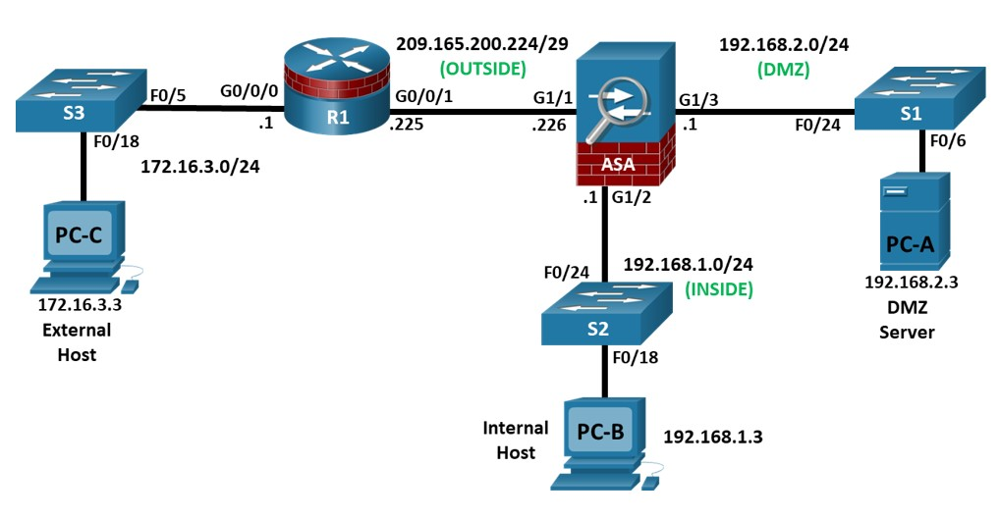

# Лабораторная работ № 8       
# Настройка Основных Параметров ASA С Помощью CLI    
## Представлена следующая топология    
  
## Таблица IP-адресации.    
  

# Цели       
## Часть 1. Настройка Основных Параметров Устройства   
## Часть 2. Откройте консоль ASA и используйте режим настройки CLI для настройки основных параметров   
## Часть 3. Настройка основных параметров ASA и уровней безопасности интерфейса   
      
## Теоретическая часть    
Cisco Adaptive Security Appliance (ASA) - это усовершенствованное устройство сетевой безопасности, которое объединяет брандмауэр с отслеживанием состояния, VPN и службы FirePOWER. В этой лаборатории используется ASA 5506-X для создания брандмауэра и защиты внутренней корпоративной сети от внешних злоумышленников, обеспечивая при этом доступ внутренних узлов к Интернету. ASA создает три интерфейса безопасности: ВНЕШНИЙ, ВНУТРЕННИЙ и DMZ. Он предоставляет внешним пользователям ограниченный доступ к DMZ и не имеет доступа к внутренним ресурсам. Внутренние пользователи могут получить доступ к DMZ и внешним ресурсам.    
Целью этой лабораторной работы является настройка ASA в качестве базового брандмауэра. Другие устройства получат минимальную конфигурацию для поддержки ASA-части этой лаборатории. В этой лаборатории используется интерфейс ASA CLI, аналогичный интерфейсу IOS CLI, для настройки основных параметров устройства и безопасности.
В части 1 этой лабораторной работы вы будете настраивать топологию и устройства, не относящиеся к ASA. В части 2 вы рассмотрите два способа настройки основных параметров ASA. В части 3 вы настроите дополнительные параметры, протестируете подключение и настроите доступ к Adaptive Security Device Manager (ASDM). ASDM предоставляет интуитивно понятный инструмент на основе графического интерфейса для настройки ASA.    
Примечание: Маршрутизаторы, используемые в практических лабораториях, - это Cisco 4221 с Cisco IOS XE версии 16.9.6 (изображение universalk9). В лабораториях используются коммутаторы Cisco Catalyst 2960+ с Cisco IOS версии 15.2 (7) (изображение lanbasek9). Можно использовать другие маршрутизаторы, коммутаторы и версии Cisco IOS. В зависимости от модели и версии Cisco IOS доступные команды и выдаваемый результат могут отличаться от того, что показано в лабораторных условиях. Правильные идентификаторы интерфейсов приведены в Сводной таблице интерфейса маршрутизатора в конце лабораторной работы.   
Примечание: Прежде чем начать, убедитесь, что маршрутизаторы и коммутаторы были удалены и не имеют конфигураций запуска.    
  
## Необходимые Ресурсы      
 3 Маршрутизатора (Cisco 4221 с универсальным образом Cisco XE версии 16.9.6 или сопоставимым с лицензией на пакет технологий безопасности)
 2 коммутатора (Cisco 2960+ с изображением Cisco IOS версии 15.2(7) lanbasek9 или аналогичным)  
 2 ПК (ОС Windows с установленной эмуляцией терминала, такой как PuTTY или Tera Term)  
 Консольные кабели для настройки сетевых устройств Cisco  
 Кабели Ethernet , как показано в топологии   
# Выполнение лабораторной работы № 8     
## Для выполнения данной лабораторной работы    
Была собрана схема на лабораторном(программном) стенде EVE-NG и все дальнейшие настройки будут выполняться по данной схеме      
    
## Часть 1. Настройка Основных Параметров Устройства   
В этой части вы настроите топологию сети и настроите основные параметры на маршрутизаторах, такие как IP-адреса интерфейса и статическая маршрутизация.  
Примечание: В настоящее время не настраивайте параметры ASA.   
### Шаг 1: Подключите кабель к сети и сбросьте предыдущие настройки устройства.   
При необходимости подсоедините устройства, показанные на схеме топологии, и подключите кабель. Убедитесь, что маршрутизатор и ASA были удалены и не имеют конфигурации запуска.   
Примечание: Чтобы избежать использования переключателей, используйте перекрестный кабель для подключения конечных устройств   
## Шаг 2: Настройте R1 и конечные устройства.   
a. Используйте следующий сценарий для настройки R1. Для этой лаборатории не потребуется никакой дополнительной настройки для R1.   
Примечание: R1 не нуждается в какой-либо маршрутизации, поскольку все входящие пакеты от ASA будут иметь 209.165.200.226 в качестве исходного IP-адреса.  

R1 Script  
enable  
configure terminal  
hostname R1  
security passwords min-length 10  
enable secret algorithm-type scrypt cisco12345  
ip domain name netsec.com  
username admin01 algorithm-type scrypt secret cisco12345  
interface GigabitEthernet0/0/0  
 ip address 172.16.3.1 255.255.255.0  
 no shutdown  
interface GigabitEthernet0/0/1  
 ip address 209.165.200.225 255.255.255.248  
 no shutdown  
crypto key generate rsa general-keys modulus 1024  
ip http server  
line con 0  
 exec-timeout 5 0  
 logging synchronous  
 login local  
line vty 0 4  
 exec-timeout 5 0  
 login local  
 transport input ssh  
end  
copy running start  

b. Настройте статический IP-адрес, маску подсети и шлюз по умолчанию для PC-A, PCB и PCC, как показано в таблице IP-адресации.  

### Шаг 3: Проверьте подключение.  
Поскольку ASA является координационным центром для сетевых зон, и он еще не настроен, подключение между подключенными к нему устройствами не будет. Однако PC-C должен иметь возможность пинговать интерфейс R1. С PC-C выполните поиск по IP-адресу R1 G0/0/1 (209.165.200.225). Если эти запросы не увенчались успехом, устраните неполадки в основных конфигурациях устройств, прежде чем продолжить.  
## Часть 2. Откройте консоль ASA и используйте CLI Setup для настройки основных параметров  
В этой части вы получите доступ к ASA через консоль и будете использовать различные команды show для определения аппаратных, программных и конфигурационных параметров. Вы очистите текущую конфигурацию и воспользуетесь утилитой интерактивной настройки CLI для настройки основных параметров ASA.  
### Шаг 1: Откройте консоль ASA.  
a. Доступ к ASA через консольный порт такой же, как и при использовании маршрутизатора или коммутатора Cisco. Подключитесь к консольному порту ASA с помощью опрокидывающего кабеля и используйте программу эмуляции терминала, такую как TeraTerm или PuTTY, чтобы открыть последовательное соединение и получить доступ к интерфейсу командной строки.  
b. Сначала ASA предложит вам предварительно настроить брандмауэр с помощью интерактивного приглашения. Мы не будем настраивать ASA таким образом, поэтому введите no и нажмите Enter. Если вы случайно запустили мастер настройки, нажмите CTRL-Z, чтобы выйти из него. На экране терминала должно отображаться имя хоста ASA user EXEC по умолчанию и запрос ciscoasa>.  
c. Вы получите запрос с запросом о настройке пароля включения для входа в привилегированный режим EXEC. Введите класс, чтобы настроить пароль, а затем еще раз, чтобы подтвердить его. Теперь вы будете находиться в привилегированном режиме EXEC.    
enable password cannot be removed    
Enter Password: class    
Repeat Password: class    
Note: Save your configuration so that the password persists across reboots    
("write memory" or "copy running-config startup-config").    
ciscoasa#    
Шаг 2: Определите версию ASA, интерфейсы и лицензию.  
ASA 5506-X поставляется со встроенным восьмипортовым коммутатором Ethernet. Порты G1/1-G1/8 являются обычными портами Gigabit Ethernet.    
Используйте команду show version, чтобы определить различные аспекты этого устройства.  
ciscoasa# show version  

Cisco Adaptive Security Appliance Software Version 9.7(1)  
Firepower Extensible Operating System Version 2.1(1.66)  
Device Manager Version 7.7(1)  

Compiled on Mon 16-Jan-17 09:01 PST by builders  
System image file is "boot:/asa971-smp-k8.bin"  
Config file at boot was "startup-config"  

ciscoasa up 5 mins 33 secs  

Hardware:   ASAv, 2048 MB RAM, CPU Clarkdale 2903 MHz,  
Model Id:   ASAv10  
Internal ATA Compact Flash, 129024MB  
Slot 1: ATA Compact Flash, 129024MB  
BIOS Flash Firmware Hub @ 0x0, 0KB  

 0: Ext: Management0/0       : address is 5000.0010.0000, irq 11  
 1: Ext: GigabitEthernet0/0  : address is 5000.0010.0001, irq 11  
 2: Ext: GigabitEthernet0/1  : address is 5000.0010.0002, irq 10  
 3: Ext: GigabitEthernet0/2  : address is 5000.0010.0003, irq 10  
 4: Ext: GigabitEthernet0/3  : address is 5000.0010.0004, irq 11  
 5: Ext: GigabitEthernet0/4  : address is 5000.0010.0005, irq 11  
 6: Ext: GigabitEthernet0/5  : address is 5000.0010.0006, irq 10  
 7: Ext: GigabitEthernet0/6  : address is 5000.0010.0007, irq 10  

License mode: Smart Licensing  
ASAv Platform License State: Unlicensed  
No active entitlement: no feature tier and no throughput level configured  
*Memory resource allocation is more than the permitted limit.  

Licensed features for this platform:  
Maximum Physical Interfaces       : 10  
Maximum VLANs                     : 50  
Inside Hosts                      : Unlimited  
Failover                          : Active/Standby  
Encryption-DES                    : Enabled  
Encryption-3DES-AES               : Enabled  
Security Contexts                 : 0  
Carrier                           : Disabled  
AnyConnect Premium Peers          : 2  
AnyConnect Essentials             : Disabled  
Other VPN Peers                   : 250  
Total VPN Peers                   : 250  
AnyConnect for Mobile             : Disabled  
AnyConnect for Cisco VPN Phone    : Disabled  
Advanced Endpoint Assessment      : Disabled  
Shared License                    : Disabled  
Total TLS Proxy Sessions          : 2  
Botnet Traffic Filter             : Enabled  
Cluster                           : Disabled  

Serial Number: 9AFD5VDF2GM  

Image type          : Release  
Key version         : A  

Configuration has not been modified since last system restart.  

## Вопросы:  
## Какая версия программного обеспечения является запущенной?       
## Как называется файл образа системы и откуда он был загружен?    
## Введите свои ответы здесь.    
## ASA можно управлять с помощью встроенного графического интерфейса, известного как ASDM. Какая версия ASDM является запущенной?    
## Введите свои ответы здесь.    
## Какова версия операционной системы Firepower Extension?          
## Сколько оперативной памяти у этого As A?  
## Введите свои ответы здесь.  
## Сколько флэш-памяти у этого As A?  
## Введите свои ответы здесь.  
## Сколько портов Ethernet у этого AS A?  
## Введите свои ответы здесь.  
## Какой тип лицензии у этого AS A?        
Шаг 3: Определите файловую систему и содержимое флэш-памяти.   
a. Отобразите файловую систему ASA с помощью команды показать файловую систему. Определите, какие префиксы поддерживаются.    
ciscoasa# show file system  

File Systems:  

     Size(b)     Free(b)      Type      Flags  Prefixes  
* 8571076608    8492691456    disk      rw      disk0: flash:  
  534495232     336928768     disk      ro      boot:  
             -             -  network   rw      tftp:  
             -             -  opaque    rw      system:  
             -             -  network   ro      http:  
             -             -  network   ro      https:  
             -             -  network   rw      scp:  
             -             -  network   rw      ftp:  
             -             -  network   wo      cluster:  
             -             -  stub      ro      cluster_trace:  
             -             -  network   rw      smb:  

   
## Как еще называется flash:?   
b. Отобразите содержимое флэш-памяти с помощью команд show flash, show disk0, dir flash: или dir disk0:. Эти команды отображают аналогичные выходные данные.  
ciscoasa# show flash  
--#--  --length--  -----date/time------  path  
   16  4096        Oct 21 2017 20:42:40  smart-log  
   17  5236        Jul 01 2022 08:27:40  smart-log/agentlog  
    8  4096        Oct 21 2017 20:30:24  log  
   10  1819        Jul 01 2022 08:20:01  log/asa-appagent.log  
   11  4096        Oct 21 2017 21:48:22  coredumpinfo  
   12  59          Oct 21 2017 20:43:06  coredumpinfo/coredump.cfg  
    7  59          Oct 21 2017 20:46:34  use_ttyS0  
   21  26709020    Oct 21 2017 21:46:54  asdm-771.bin  
   22  29942546    Dec 08 2017 07:56:38  anyconnect-win-4.4.01054-webdeploy-k9.g  

8571076608 bytes total (8492691456 bytes free)  

Как называется файл ASDM во flash:?      
### Шаг 4: Определите текущую текущую конфигурацию.    
ASA 5506-X обычно используется в качестве пограничного устройства безопасности, которое соединяет малый бизнес  с устройством интернет-провайдера, таким как DSL или кабельный модем, для доступа в Интернет.    
a. Отобразите текущую текущую конфигурацию с помощью команды show running-config.      
ciscoasa# show running-config   
: Saved  

:
: Serial Number: 9AFD5VDF2GM  
: Hardware:   ASAv, 2048 MB RAM, CPU Clarkdale 2903 MHz  
:
ASA Version 9.7(1)  
!
hostname ciscoasa  
enable password $sha512$5000$uVo7mQJnnj35qWt+LCLb8w==$YdUyvqvvj9wI0qCvrKAqoQ== 2  
names  

!  
interface GigabitEthernet0/0  
 shutdown  
 no nameif  
 no security-level  
 no ip address  
!

<output omitted>    
Примечание: Чтобы остановить вывод команды с помощью интерфейса командной строки, нажмите Q.    
Вы также можете увидеть другие функции безопасности, такие как глобальная политика, которая проверяет трафик выбранных приложений, который ASA вставляет по умолчанию, если исходная конфигурация запуска была удалена. Фактический выходной сигнал варьируется в зависимости от модели, версии и состояния конфигурации ASA.  
b. Вы можете восстановить заводские настройки ASA по умолчанию с помощью команды настроить глобальную конфигурацию по умолчанию. При вводе глобальной конфигурации вам сначала будет предложено включить анонимное сообщение об ошибках. Введите N, в противном случае введите A, чтобы получить запрос на это позже.  

ciscoasa# conf t  
ciscoasa(config)#   

***************************** NOTICE *****************************  

Help to improve the ASA platform by enabling anonymous reporting,  
which allows Cisco to securely receive minimal error and health  
information from the device. To learn more about this feature,  
please visit: http://www.cisco.com/go/smartcall  

Would you like to enable anonymous error reporting to help improve   
the product? [Y]es, [N]o, [A]sk later: N  

In the future, if you would like to enable this feature,  
issue the command "call-home reporting anonymous".  

Please remember to save your configuration.  

ciscoasa(config)# configure factory-default   
Based on the inside IP address and mask, the DHCP address  
pool size is reduced to 250 from the platform limit 256   

WARNING: The boot system configuration will be cleared.  
The first image found in disk0:/ will be used to boot the  
system on the next reload.  
Verify there is a valid image on disk0:/ or the system will  
not boot.  

Begin to apply factory-default configuration:    
Clear all configuration    
Executing command: !    
Executing command: interface Management1/1    
Executing command:  management-only    
Executing command:  no nameif    
Executing command:  no security-level    
Executing command:  no ip address    
Executing command:  no shutdown    
Executing command:  exit    
Executing command: !    
Executing command: interface GigabitEthernet1/1    
Executing command:  nameif outside    
INFO: Security level for "outside" set to 0 by default.    
Executing command:  security-level 0    
Executing command:  no shutdown    
<output omitted>     
Executing command: same-security-traffic permit inter-interface    
Executing command: !    
Executing command: !    
Factory-default configuration is completed    
ciscoasa(config)#    

c. Возможно, вы захотите записать и распечатать заводскую конфигурацию по умолчанию в качестве справочной. Используйте программу эмуляции терминала, чтобы скопировать его из ASA и вставить в текстовый документ. Затем вы можете при желании отредактировать этот файл, чтобы он содержал только допустимые команды. Вы должны удалить команды пароля и ввести команду no shut, чтобы включить нужные интерфейсы.    
  Шаг 5: Очистите предыдущие настройки конфигурации ASA.  
a. Используйте команду write erase для удаления файла startup-config из флэш-памяти.    
ciscoasa(config)# end    
ciscoasa# write erase    
Erase configuration in flash memory? [confirm] <Enter>    
[OK]    
ciscoasa# show start    
No Configuration    
ciscoasa#     
Примечание: Команда IOS erase startup-config не поддерживается на ASA.    
 b. Используйте команду перезагрузки, чтобы перезапустить ASA. Это приводит к тому, что ASA отображается в режиме настройки CLI. Если появится запрос о том, что конфигурация была изменена и ее необходимо сохранить, ответьте N, а затем нажмите Enter, чтобы продолжить перезагрузку.    
ciscoasa# reload    
System config has been modified. Save? [Y]es/[N]o:  n    
Proceed with reload? [confirm] <Enter>    
ciscoasa#     
***    
*** --- START GRACEFUL SHUTDOWN ---    
Shutting down isakmp    
Shutting down webvpn  
Shutting down sw-module    
Shutting down License Controller    
Shutting down File system    
<output omitted>     
 Шаг 6: Используйте интерактивный режим CLI Setup для настройки основных параметров.    
Когда ASA завершит процесс перезагрузки, он должен обнаружить, что файл startup-config отсутствует, и предложить вам предварительно настроить брандмауэр с помощью интерактивных подсказок. Здесь представлен ряд интерактивных подсказок для настройки основных параметров ASA.    
Примечание: Режим интерактивного запроса не настраивает ASA с заводскими настройками по умолчанию, как описано в шаге 4. Этот режим можно использовать для настройки минимальных базовых параметров, таких как имя хоста, часы и пароли. Вы также можете перейти непосредственно к интерфейсу командной строки для настройки параметров ASA, как описано в части 3.    
a. Ответьте на интерактивные подсказки настройки, как показано здесь, после перезагрузки ASA.      
  Pre-configure Firewall now through interactive prompts [yes]? <Enter>  
Firewall Mode [Routed]: <Enter>  
Enable password [<use current password>]: class  
Allow password recovery [yes]? <Enter>  
Clock (UTC): <Enter>  
  Year [2021]: <Enter>  
  Month [Feb]: <Enter>  
  Day [22]: <Enter>  
  Time [15:16:32]: <Enter>  
Management IP address: 192.168.100.1  
Management network mask: 255.255.255.0  
Host name: ASA-Init  
Domain name: generic.com  
IP address of host running Device Manager: <Enter>  

The following configuration will be used:  
Enable password: class  
Allow password recovery: yes   
Clock (UTC): 07:29:14 Mar 19 2019  
Firewall Mode: Routed  
Management IP address: 192.168.100.1  
Management network mask: 255.255.255.0  
Host name: ASA-Init  
Domain name: generic.com  

Use this configuration and save to flash? [yes] <Enter>   
INFO: Security level for "management" set to 0 by default.  
Cryptochecksum: d0b22e76 5178e9e6 0a6bc590 5f5e5a3d  

3958 bytes copied in 0.80 secs  

User enable_1 logged in to ASA-Init  
Logins over the last 1 days: 1.  
Failed logins since the last login: 0.  
Type help or '?' for a list of available commands.  
ASA-Init>  

Примечание: В приведенной выше конфигурации IP-адрес хоста, на котором выполняется ASDM, был оставлен пустым. Нет необходимости устанавливать ASDM на хосте. Он может быть запущен из флэш-памяти самого устройства ASA с помощью браузера хоста.      
Примечание: Ответы на запросы автоматически сохраняются в startup-config и running config. Однако дополнительные команды, связанные с безопасностью, такие как карта политики global_policy, которая использует класс inspection_default, вставляются в running-config операционной системой ASA.      
b. Войдите в привилегированный режим EXEC с помощью команды enable. Введите класс для пароля.      
c. Выполните команду show run, чтобы просмотреть дополнительные команды настройки, связанные с безопасностью, которые вставляются ASA.      
d. Выполните команду записи в память, чтобы зафиксировать дополнительные команды, связанные с безопасностью, в файле startup-config.       

Часть 3: Настройка параметров ASA и безопасности интерфейса  
В этой части вы настроите основные параметры с помощью интерфейса командной строки ASA, хотя некоторые из них уже были настроены с помощью интерактивных подсказок режима настройки в предыдущей части. В этой части вы начнете с настроек, настроенных в предыдущей части, а затем добавите или измените их, чтобы создать полную базовую конфигурацию.    
Совет: Многие команды ASA CLI похожи, если не совпадают, с командами, используемыми с Cisco IOS CLI. Кроме того, процесс перехода между режимами конфигурации и подрежимами по существу один и тот же.  
Примечание: Вы должны завершить предыдущую часть, прежде чем приступить к этой части.  
Шаг 1: Настройте имя хоста и доменное имя.    
a. Войдите в режим глобальной конфигурации с помощью команды config t. При первом входе в режим настройки после запуска программы установки вам будет предложено включить анонимную отчетность. Ответьте "нет".    
 ASA-Init# config t  
ASA-Init(config)#  

***************************** NOTICE *****************************  

Help to improve the ASA platform by enabling anonymous reporting,  
which allows Cisco to securely receive minimal error and health  
information from the device. To learn more about this feature,  
please visit: http://www.cisco.com/go/smartcall  

Would you like to enable anonymous error reporting to help improve  
the product? [Y]es, [N]o, [A]sk later: n  

In the future, if you would like to enable this feature,  
issue the command "call-home reporting anonymous".  

Please remember to save your configuration.  

b. Настройте имя хоста ASA с помощью команды hostname.  
 ASA-Init(config)# hostname NETSEC-ASA  
c. Настройте доменное имя с помощью команды domain-name.  
NETSEC-ASA(config)# domain-name netsec.com  
Шаг 2: Настройте пароли для входа в систему и включения режима.  
a. Пароль для входа используется для подключений по Telnet (и SSH до ASA версии 8.4). По умолчанию для него установлено значение cisco, но поскольку конфигурация запуска по умолчанию была удалена, у вас есть возможность настроить пароль для входа с помощью команды passwd или password. Эта команда необязательна, потому что позже в лаборатории мы настроим ASA для SSH, а не для доступа по Telnet.  
NETSEC-ASA(config)# passwd cisco    
 b. Настройте пароль привилегированного режима EXEC (enable) с помощью команды enable password.  
NETSEC-ASA(config)# enable password class   
### Шаг 3: Установите дату и время.  
Дату и время можно установить вручную с помощью команды clock set. Синтаксис команды установки часов таков: установка часов чч:мм:сс {день месяца | день месяца} год. В следующем примере показано, как установить дату и время с помощью 24-часовых часов:          
NETSEC-ASA(config)# clock set 11:42:00 jul 1 2021    
Шаг 4: Настройте  INSIDE и OUTSIDE интерфейсы.  
На этом шаге вы настроите внутренний и внешний интерфейсы, назовете их, назначите IP-адреса и установите уровень безопасности интерфейса.  
В части 2 интерфейс MGMT был настроен с IP-адресом 192.168.100.1. Вы настроите другой интерфейс в качестве  INSIDE интерфейса для этой лаборатории и удалите IP-адресацию для M1/1. На данный момент вы будете настраивать только INSIDE и OUTSIDE интерфейсы. Интерфейс DMZ будет настроен в следующей лаборатории.  
a. Настройте интерфейс G1/2 для INSIDE сети, 192.168.1.0/24. Назовите интерфейс  INSIDE, установите уровень безопасности на максимальное значение 100 и включите его.         

NETSEC-ASA(config)# interface g0/2    
NETSEC-ASA(config-if)# nameif INSIDE  
INFO: Security level for "INSIDE" set to 100 by default.  
NETSEC-ASA(config-if)# ip address 192.168.1.1 255.255.255.0  
NETSEC-ASA(config-if)# security-level 100  
NETSEC-ASA(config-if)# no shutdown  
NETSEC-ASA(config-if)# exit  
 
 b. Настройте интерфейс G0/1 для OUTSIDE сети, 209.165.200.224/29. Назовите OUTSIDE интерфейс, установите уровень безопасности на самое низкое значение 0 и включите его.       

NETSEC-ASA(config)# interface g0/1  
NETSEC-ASA(config-if)# nameif OUTSIDE  
INFO: Security level for "OUTSIDE" set to 0 by default.  
NETSEC-ASA(config-if)# ip address 209.165.200.226 255.255.255.248  
NETSEC-ASA(config-if)# security-level 0  
NETSEC-ASA(config-if)# no shutdown  

 c. Посмотрел конфигурацию  интерфейса M0/0  - интерфейс выключен.        

 interface Management0/0  
 shutdown  
 no nameif  
 no security-level  
 no ip address  

Вы можете получить сообщение о том, что уровень безопасности для INSIDE интерфейса был автоматически установлен на 100, а для OUTSIDE интерфейса был установлен на 0. ASA использует уровни безопасности интерфейса от 0 до 100 для обеспечения соблюдения политики безопасности. Уровень безопасности 100 (INSIDE) является наиболее безопасным, а уровень 0 (OUTSIDE) - наименее безопасным.  
По умолчанию ASA применяет политику, согласно которой трафик с интерфейса более высокого уровня безопасности на интерфейс более низкого уровня разрешен, а трафик с интерфейса более низкого уровня безопасности на интерфейс с более высоким уровнем безопасности запрещен. Политика безопасности ASA по умолчанию разрешает исходящий трафик, который по умолчанию проверяется. Обратный трафик разрешен благодаря проверке пакетов с отслеживанием состояния. Это поведение брандмауэра ASA в “маршрутизируемом режиме” по умолчанию позволяет маршрутизировать пакеты из INSIDE сети во OUTSIDE сеть, но не наоборот. В последней части этой лабораторной работы вы настроите NAT для повышения защиты брандмауэра.  
d. Отобразите статус для всех интерфейсов ASA с помощью команды show interface ip brief.  
### Примечание: Синтаксис команды отличается от команды show ip interface brief IOS. Если какой-либо из ранее настроенных физических или логических интерфейсов не работает, при необходимости устраните неполадки, прежде чем продолжить.  
### Совет: Большинство команд ASA show, а также ping, copy и другие могут быть выданы из любого приглашения режима конфигурации без команды do, которая требуется в IOS.       

NETSEC-ASA# show interface ip brief  
Interface                  IP-Address      OK? Method Status                Prol  
GigabitEthernet0/0         unassigned      YES unset  administratively down up   
GigabitEthernet0/1         209.165.200.226 YES manual up                    up  
GigabitEthernet0/2         192.168.1.1     YES manual up                    up  
GigabitEthernet0/3         unassigned      YES unset  administratively down up  
GigabitEthernet0/4         unassigned      YES unset  administratively down up  
GigabitEthernet0/5         unassigned      YES unset  administratively down up  
GigabitEthernet0/6         unassigned      YES unset  administratively down up  
Management0/0              unassigned      YES unset  administratively down up  

e. Отобразите информацию об интерфейсе уровня 3 с помощью команды show ip address.    

NETSEC-ASA# show ip address  
System IP Addresses:  
Interface                Name                   IP address      Subnet mask     Method  
GigabitEthernet0/1       OUTSIDE                209.165.200.226 255.255.255.248 manual  
GigabitEthernet0/2       INSIDE                 192.168.1.1     255.255.255.0   manual  
Current IP Addresses:  
Interface                Name                   IP address      Subnet mask     Method  
GigabitEthernet0/1       OUTSIDE                209.165.200.226 255.255.255.248 manual  
GigabitEthernet0/2       INSIDE                 192.168.1.1     255.255.255.0   manual  

f. Вы также можете использовать команду show running-config interface для отображения конфигурации для конкретного интерфейса из running-config.  
NETSEC-ASA# show run interface g0/1  
!  
interface GigabitEthernet0/1  
 nameif OUTSIDE  
 security-level 0  
 ip address 209.165.200.226 255.255.255.248   

 Шаг 5: Проверьте подключение к ASA.  
a. Убедитесь, что PCB имеет статический IP-адрес 192.168.1.3, маску подсети 255.255.255.0 и шлюз по умолчанию 192.168.1.1.  
b. Вы должны иметь возможность отправлять запросы с PCB на адрес INSIDE интерфейса ASA и отправлять запросы с ASA на PC-B. Если пинги завершаются неудачей, при необходимости устраните неполадки в конфигурации.   

NETSEC-ASA# ping 192.168.1.3  
Type escape sequence to abort.  
Sending 5, 100-byte ICMP Echos to 192.168.1.3, timeout is 2 seconds:  
!!!!!  
Success rate is 100 percent (5/5), round-trip min/avg/max = 1/2/10 ms  

c. С ПК-C выполните поиск по IP-адресу OUTSIDE интерфейса 209.165.200.226. В качестве альтернативы, вместо настройки PCC только для проверки ping, вы можете отправить ping из интерфейса G0/0/0 на R1. Вы не должны иметь возможности пинговать OUTSIDE интерфейс.    
PC-C> ping 209.165.200.226  

209.165.200.226 icmp_seq=1 timeout  
209.165.200.226 icmp_seq=2 timeout  
209.165.200.226 icmp_seq=3 timeout  
209.165.200.226 icmp_seq=4 timeout  
209.165.200.226 icmp_seq=5 timeout  

R1#ping 209.165.200.226 source 172.16.3.1  
Type escape sequence to abort.  
Sending 5, 100-byte ICMP Echos to 209.165.200.226, timeout is 2 seconds:  
Packet sent with a source address of 172.16.3.1  
.....  
Success rate is 0 percent (0/5)  
R1#  

Шаг 6: Настройте доступ ASDM к ASA.    
ASDM предоставляет интуитивно понятный инструмент на основе графического интерфейса для настройки ASA с ПК.  
a. Настройте ASA так, чтобы разрешить HTTPS-соединения с любого хоста во INSIDE сети (192.168.1.0/24), используя команду http server enable в режиме глобальной конфигурации. Это позволяет получить доступ к графическому интерфейсу ASA (ASDM).  
NETSEC-ASA(config-if)# exit  
NETSEC-ASA(config)# http server enable  
NETSEC-ASA(config)# http 192.168.1.0 255.255.255.0 INSIDE  
b. Откройте браузер на PC-B и протестируйте HTTPS-доступ к ASA, введя https://192.168.1.1 . Вам будет предложено указать, что соединение небезопасно. Выберите опцию, которая позволит вам перейти на веб-страницу.  
c. Затем вы должны увидеть экран приветствия Cisco ASDM, который позволяет вам либо установить ASDM Launcher, либо установить Java Web Start для запуска ASDM в качестве приложения Java Web start.  
Примечание: Если вы или ваш инструктор уже установили Cisco ASDM-ID Launcher, откройте приложение.    
d. Затем от вас потребуется пройти аутентификацию в ASA. Поскольку имя пользователя не было указано, просто введите класс enable password в поле password.
e. Закройте браузер или программу запуска Cisco ASDM-ID. Использование ASDM для настройки ASA выходит за рамки данного курса. Тем не менее, после резюме для этого модуля есть дополнительный раздел с дополнительной информацией об ASDM, а также тремя дополнительными лабораторными работами. Целью здесь является не использование экранов конфигурации ASDM, а проверка подключения HTTP/ASDM к ASA. Если вы не можете получить доступ к ASDM, проверьте свои конфигурации. Если настройки правильные, обратитесь к своему инструктору за дополнительной помощью.    
Шаг 7: Сохраните конфигурацию ASA для следующей лабораторной работы.  
В следующей лабораторной работе вы расширите свою текущую конфигурацию, добавив DMZ, маршрутизацию, NAT, DHCP, AAA и SSH. Если вы готовы сейчас, пройдите в эту лабораторию. Если нет, сохраните настройки для загрузки в следующую лабораторную работу.        
      
      
      
