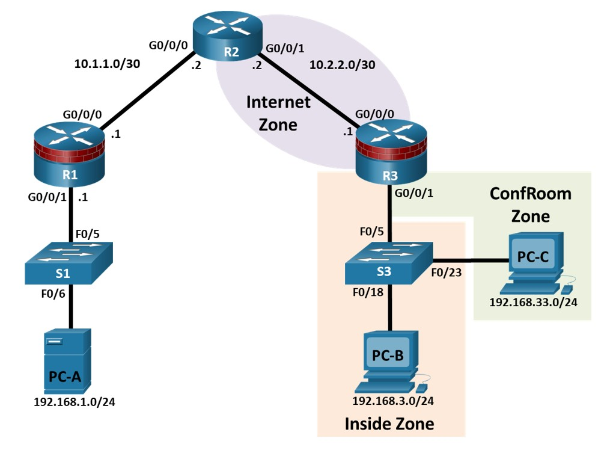
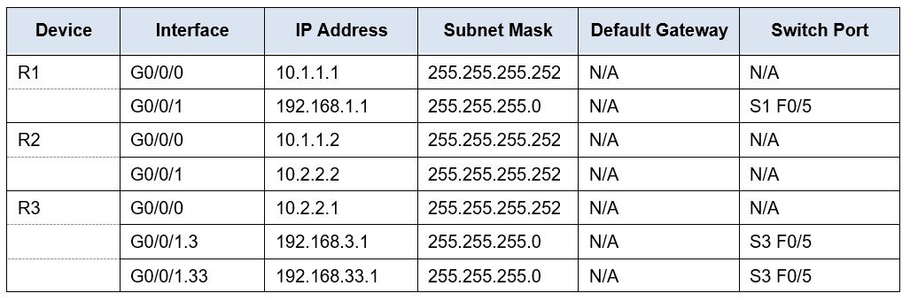
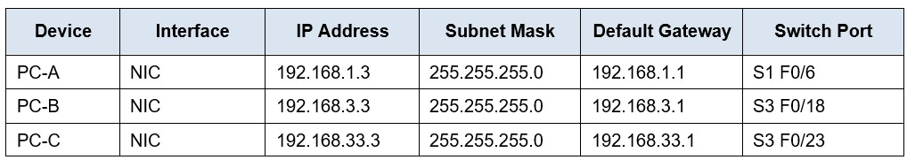
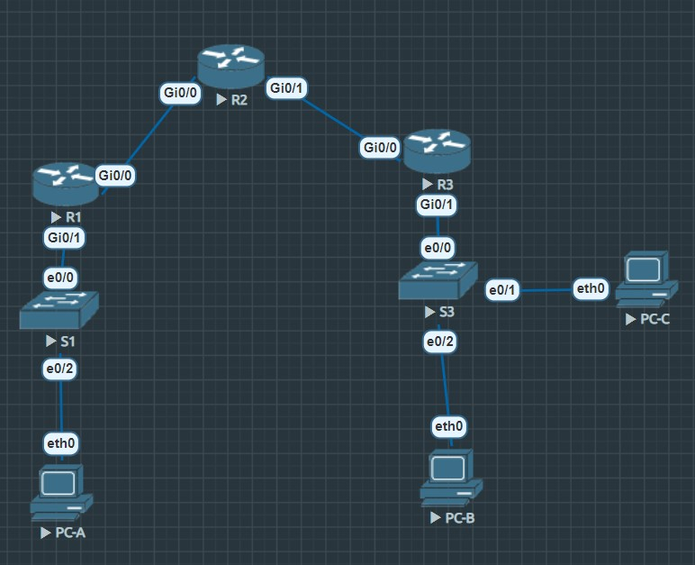
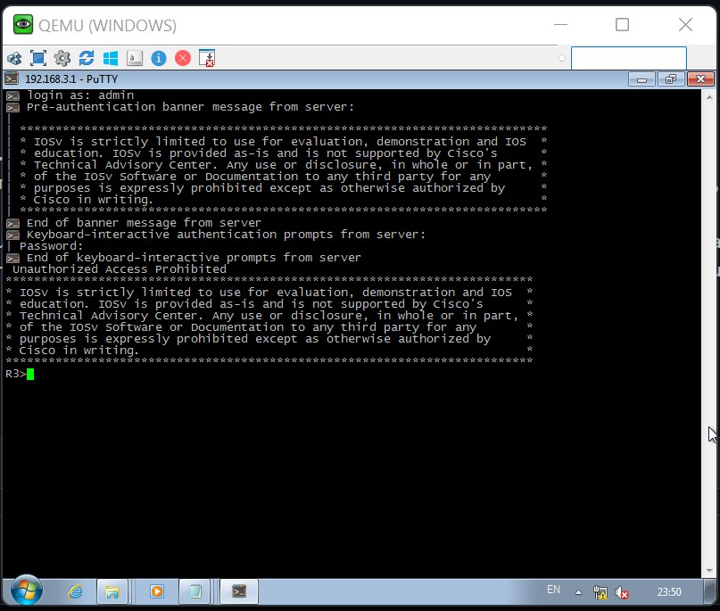
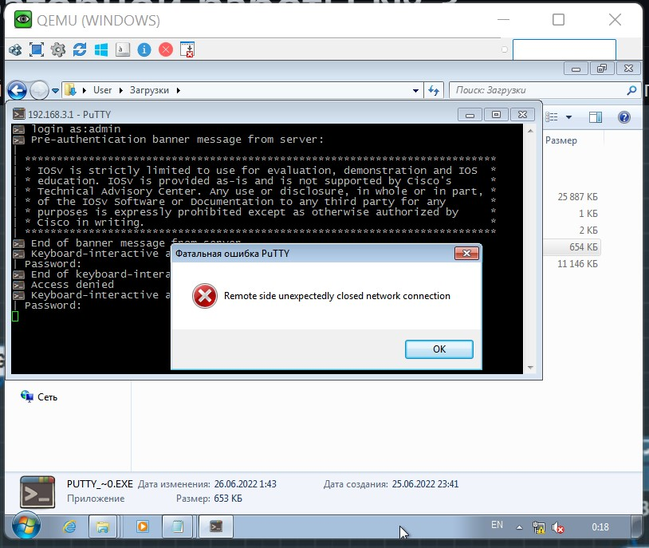

# Лабораторная работ № 5     
# Настройка ZFS  
## Представлена следующая топология    
  
## Таблица IP-адресации.    
  
  
# Цели       
## Часть 1: Базовая конфигурация устройства    
 Настройте имена хостов, IP-адреса интерфейсов и пароли доступа на маршрутизаторах.    
 Настройте статические маршруты, чтобы включить сквозное подключение на маршрутизаторах.    
 Настройте порты доступа и магистрали на коммутаторе.    
## Часть 2. Настройка брандмауэра политики на основе зон (ZPF)    
 Используйте интерфейс командной строки для настройки брандмауэра политики на основе зон.    
 Используйте интерфейс командной строки для проверки конфигурации.    
## Часть 3: Проверка функциональности брандмауэра ZPF    
      
## Теоретическая часть    
Самая базовая форма брандмауэра Cisco IOS использует списки управления доступом (ACL) для фильтрации IP-трафика и мониторинга установленных шаблонов трафика. Традиционный брандмауэр Cisco IOS - это брандмауэр на основе ACL.  
Новая реализация брандмауэра Cisco IOS использует подход, основанный на зонах, который работает как функция интерфейсов вместо списков контроля доступа. Брандмауэр политики на основе зон (ZPF) позволяет применять различные политики проверки к нескольким группам хостов, подключенных к одному интерфейсу маршрутизатора. Он может быть сконфигурирован для чрезвычайно продвинутого, специфичного для протокола, детального управления. Он запрещает трафик с помощью политики запрета доступа по умолчанию между различными зонами брандмауэра. ZPF подходит для нескольких интерфейсов, которые имеют схожие или различные требования к безопасности.
В этой лаборатории вы создаете сеть с несколькими маршрутизаторами, настраиваете маршрутизаторы и узлы ПК, а также настраиваете брандмауэр политики на основе зон с помощью интерфейса командной строки Cisco IOS (CLI).  
Примечание: Маршрутизаторы, используемые в практических лабораториях, - это Cisco 4221 с Cisco IOS XE версии 16.9.4 (изображение universalk9). В лабораториях используются коммутаторы Cisco Catalyst 2960+ с Cisco IOS версии 15.2 (2) (изображение lanbasek9). Можно использовать другие маршрутизаторы, коммутаторы и версии Cisco IOS. В зависимости от модели и версии Cisco IOS доступные команды и выдаваемый результат могут отличаться от того, что показано в лабораторных условиях. Правильные идентификаторы интерфейсов приведены в Сводной таблице интерфейса маршрутизатора в конце лабораторной работы.  
Примечание: Убедитесь, что маршрутизаторы и коммутаторы были удалены и не имеют конфигураций запуска.  

## Необходимые Ресурсы    
3 маршрутизатора (Cisco 4221 с универсальным образом Cisco IOS XE версии 16.9.4 или аналогичным)    
 2 коммутатора (Cisco 2960+ с изображением Cisco IOS версии 15.2(7) lanbasek9 или аналогичным)    
 3 ПК (ОС Windows с установленной программой эмуляции терминала, такой как Tera Term или PuTTY)    
 Консольные кабели для настройки устройств Cisco IOS через консольные порты    
 Кабели Ethernet , как показано в топологии   
# Выполнение лабораторной работы № 5   
## Для выполнения данной лабораторной работы   
Была собрана схема на лабораторном(программном) стенде EVE-NG и все дальнейшие настройки будут выполняться по данной схеме      
  
## Часть 1: Базовая конфигурация устройства   
В этой части этой лабораторной работы вы настраиваете топологию сети и настраиваете основные параметры, такие как IP-адреса интерфейса, статическая маршрутизация, доступ к устройствам и пароли.    
Примечание: Все задачи должны выполняться на маршрутизаторах R1, R2 и R3. Процедуры показаны только для одного из маршрутизаторов.   
### Шаг 1: Подключите сеть, как показано в топологии.  
Подсоедините устройства, как показано на схеме топологии, и при необходимости подключите кабель.  
### Шаг 2: Отключите поиск DNS.  
Открыть окно конфигурации  
Чтобы предотвратить попытки маршрутизатора перевести неправильно введенные команды, отключите поиск DNS.   
### Шаг 3: Настройте основные параметры для каждого маршрутизатора.  
a. Настройте имена узлов, как показано в топологии.  
b. Настройте IP-адреса интерфейса, как показано в таблице IP-адресации. Конфигурация IP-адреса для маршрутизатора R3 приведена ниже.     
R3(config)# interface GigabitEthernet0/0/0   
R3(config-if)# ip address 10.2.2.1 255.255.255.252   
R3(config-if)# no shutdown  
R3(config-if)# interface GigabitEthernet0/0/1   
R3(config-if)# no shutdown   
R3(config-if)# interface GigabitEthernet0/0/1.3   
R3(config-if)# encapsulation dot1Q 3  
R3(config-if)# ip address 192.168.3.1 255.255.255.0   
R3(config-if)#interface GigabitEthernet0/0/1.33  
R3(config-if)# encapsulation dot1Q 33   
R3(config-if)# ip address 192.168.33.1 255.255.255.0   

### Шаг 4: Настройте статические маршруты на R1, R2 и R3.   
a. Для достижения сквозной доступности IP-адресов на R1, R2 и R3 должны быть настроены соответствующие статические маршруты. R1 и R3 являются маршрутизаторами-заглушками, и поэтому им нужен только маршрут по умолчанию, указывающий на R2. R2, действующий как интернет-провайдер, должен знать, как добраться до R1 и Внутренние сети R3 до достижения сквозной IP-доступности. Ниже приведена статическая конфигурация маршрута для R1, R2 и R3. На R1 используйте следующую команду:   
R1(config)# ip route 0.0.0.0 0.0.0.0 10.1.1.2    
b. На R2 используйте следующие команды.   
R2(config)# ip route 192.168.1.0 255.255.255.0 10.1.1.1  
R2(config)# ip route 192.168.3.0 255.255.255.0 10.2.2.1   
R2(config)# ip route 192.168.33.0 255.255.255.0 10.2.2.1  
c. На R3 используйте следующую команду.   
R3(config)# ip route 0.0.0.0 0.0.0.0 10.2.2.2    
### Шаг 5: Настройте S3.  
a. Настройка магистрального канала:  
S3(config)# interface e0/0  
S3(config-if)# switchport mode trunk  
b. Настройте порты доступа.  
S3(config)# vlan 3 -создаем vlan 3
S3(config)# interface e0/2  
S3(config-if)# switchport mode access 
S3(config-if)# switchport access vlan 3  
S3(config)# vlan 33 -создаем vlan 33
S3(config-if)# interface e0/1  
S3(config-if)# switchport mode access  
S3(config-if)# switchport access vlan 33 

### Шаг 6: Настройте параметры IP-адреса хоста ПК.  
Настройте статический IP-адрес, маску подсети и шлюз по умолчанию для PC-A, PC-B и PC-C, как показано в таблице IP-адресации. 
PC-A
ip 192.168.1.3 255.255.255.0 192.168.1.1
Checking for duplicate address...
PC1 : 192.168.1.3 255.255.255.0 gateway 192.168.1.1

### Шаг 7: Проверьте базовое сетевое подключение.  
a. Выполните пинг от R1 до R3.  
R1#ping 10.2.2.1
Type escape sequence to abort.
Sending 5, 100-byte ICMP Echos to 10.2.2.1, timeout is 2 seconds:
!!!!!
Success rate is 100 percent (5/5), round-trip min/avg/max = 4/4/5 ms

Если запросы не прошли успешно, устраните неполадки в основных конфигурациях устройства, прежде чем продолжить.   
b. Выполните пинг с ПК-A в локальной сети R1 на ПК-B и ПК-C в локальной сети R3. 
VPCS> ping 192.168.3.1

84 bytes from 192.168.3.1 icmp_seq=1 ttl=253 time=4.827 ms
84 bytes from 192.168.3.1 icmp_seq=2 ttl=253 time=3.449 ms
84 bytes from 192.168.3.1 icmp_seq=3 ttl=253 time=3.332 ms
84 bytes from 192.168.3.1 icmp_seq=4 ttl=253 time=3.428 ms
84 bytes from 192.168.3.1 icmp_seq=5 ttl=253 time=3.680 ms

VPCS> ping 192.168.3.3

192.168.3.3 icmp_seq=1 timeout
192.168.3.3 icmp_seq=2 timeout
192.168.3.3 icmp_seq=3 timeout
192.168.3.3 icmp_seq=4 timeout
192.168.3.3 icmp_seq=5 timeout

VPCS> ping 192.168.33.3

192.168.33.3 icmp_seq=1 timeout
192.168.33.3 icmp_seq=2 timeout
192.168.33.3 icmp_seq=3 timeout
192.168.33.3 icmp_seq=4 timeout
192.168.33.3 icmp_seq=5 timeout

Если запросы не прошли успешно, устраните неполадки в основных конфигурациях устройства, прежде чем продолжить.  
Примечание: Если вы можете выполнить пинг с ПК-A на ПК-C, вы продемонстрировали, что достигнута сквозная доступность IP-адреса. Если вы не можете выполнить поиск, но интерфейсы устройств подключены, а IP-адреса указаны правильно, используйте команды показать интерфейс, показать ip-интерфейс и показать ip-маршрут, чтобы помочь выявить проблемы.   
### Шаг 8: Настройте учетную запись пользователя, зашифрованные пароли и крипто-ключи для SSH.   
Примечание: Пароли в этой задаче задаются минимум из 10 символов, но они относительно просты для удобства выполнения лабораторной работы. В производственной сети рекомендуется использовать более сложные пароли.   
a. Настройте минимальную длину пароля с помощью команды security passwords, чтобы установить минимальную длину пароля в 10 символов.  
R1(config)# security passwords min-length 10   
б. Настройте доменное имя.  
R1(config)# ip domain-name netsec.com    
c. Настройка криптографических ключей для SSH  
R1(config)# crypto key generate rsa general-keys modulus 1024     
d. Настройте учетную запись пользователя admin 01, используя algorithm-typescript для шифрования и пароль cisco12345.   
R1(config)# username admin01 algorithm-type scrypt secret cisco12345  
e. Настройте консоль line console 0 для использования локальной базы данных пользователей для входа в систему. Для дополнительной безопасности команда exec-timeout приводит к выходу из системы после 5 минут бездействия. Синхронная команда ведения журнала предотвращает прерывание ввода команды сообщениями консоли.  
Примечание: Чтобы избежать повторяющихся входов в систему во время этой лабораторной работы, команда exec-timeout может быть установлена в 0 0, что предотвращает ее истечение; однако это не считается хорошей практикой безопасности.    
R1(config)# line console 0    
R1(config-line)# login local    
R1(config-line)# exec-timeout 5 0    
R1(config-line)# logging synchronous  
f. Настройте строку aux 0 для использования локальной базы данных пользователей для входа в систему.   
R1(config)# line aux 0   
R1(config-line)# login local  
R1(config-line)# exec-timeout 5 0  
g. Настройте строку vty 0 4 на использование локальной базы данных пользователей для входа в систему и ограничьте доступ только к SSH-соединениям.   
R1(config)# line vty 0 4  
R1(config-line)# login local  
R1(config-line)# transport input ssh  
R1(config-line)# exec-timeout 5 0  
h. Настройте пароль для включения с помощью надежного шифрования.  
R1(config)# enable algorithm-type scrypt secret class12345  
### Шаг 9: Сохраните базовую текущую конфигурацию для всех трех маршрутизаторов.  
Сохраните текущую конфигурацию в конфигурации запуска из привилегированной командной строки EXEC.  
R1# copy running-config startup-config  
## Часть 2. Настройка брандмауэра политики на основе зон (ZPF)  
В этой части вы создадите брандмауэр политики на основе зон на R3 с использованием интерфейса командной строки (CLI), что позволит ему действовать не только как маршрутизатор, но и как брандмауэр. R3 в настоящее время отвечает за маршрутизацию пакетов для трех подключенных к нему сетей. Роли интерфейса R3 настраиваются следующим образом:  
G0/0/0 подключен к Интернету. Поскольку это общедоступная сеть, она считается ненадежной сетью и должна иметь самый низкий уровень безопасности.  
G0/0/1.3 подключен к внутренней сети. Только авторизованные пользователи имеют доступ к этой сети. Кроме того, в этой сети также находятся жизненно важные ресурсы учреждения. Внутренняя сеть должна считаться надежной сетью и должна иметь самый высокий уровень безопасности.   
G0/0/1.33 соединен с конференц-залом. Конференц-зал используется для проведения встреч с людьми, которые не являются частью организации.   
Политика безопасности, которую должен применять R3, когда он действует как брандмауэр, диктует, что:  
 Трафик, инициированный из Интернета, не должен попадать во внутренние сети или сети конференц-залов.  
 Возврат интернет-трафика (возврат пакетов, поступающих из Интернета на сайт R3, в ответ на запросы, исходящие из любой из сетей R3) должен быть разрешен.
 Компьютеры во внутренней сети R3 считаются доверенными, и им разрешено инициировать трафик любого типа (трафик на основе TCP, UDP или ICMP).  
 Компьютеры в сети конференц-зала R3 считаются ненадежными, и им разрешено инициировать только веб-трафик (HTTP или HTTPS) в Интернет.  
 Трафик между внутренней сетью и сетью конференц-зала запрещен. Нет никаких гарантий относительно состояния гостевых компьютеров в сети конференц-зала. Такие машины могут быть заражены вредоносными программами и могут пытаться рассылать спам или другой вредоносный трафик.  
### Шаг 1: Проверьте сквозное сетевое подключение.  
На этом шаге вы проверите сквозное сетевое подключение перед внедрением ZPF.  
Откройте окно конфигурации   
a. Выполните поиск с R1 на R3, используя оба IP-адреса интерфейса R3 G0/0/1 (192.168.3.1 и 192.168.33.1).  
Если запросы не прошли успешно, устраните неполадки в основных конфигурациях устройства, прежде чем продолжить.  
b. Выполните пинг с ПК-A в локальной сети R1 на ПК-C в локальной сети конференц-зала R3.  
Если запросы не прошли успешно, устраните неполадки в основных конфигурациях устройства, прежде чем продолжить.  
c. Выполните пинг с ПК-A по локальной сети R1 на ПК-B по внутренней локальной сети R3.  
Если запросы не прошли успешно, устраните неполадки в основных конфигурациях устройства, прежде чем продолжить.  
### Шаг 2: Отобразите запущенные конфигурации R3.  
На этом шаге вы проверите запущенные конфигурации R3 перед внедрением ZPF.  
a. Выполните краткую команду show ip interface brief на R3, чтобы убедиться, что были назначены правильные IP-адреса. Используйте таблицу адресов для проверки адресов. 
b. Выполните команду show ip route на R3, чтобы убедиться, что у него есть статический маршрут по умолчанию, указывающий на интерфейс R2 G0/0/1.  
c. Выполните команду show run, чтобы просмотреть текущую базовую конфигурацию на R3.    
### Шаг 3: Создание зон безопасности.  
Зона безопасности - это группа интерфейсов со схожими свойствами безопасности и требованиями. Например, если маршрутизатор имеет три интерфейса, подключенных к внутренним сетям, все три интерфейса могут быть размещены в одной и той же зоне с именем “internal”. Поскольку все свойства безопасности настраиваются для зоны, а не для отдельных интерфейсов маршрутизатора, конструкция брандмауэра намного более масштабируема.
В этой лаборатории сайт R3 имеет три интерфейса: один подключен к внутренней доверенной сети, один подключен к сети конференц-зала, а другой подключен к Интернету. Поскольку все три сети имеют разные требования и свойства к безопасности, мы создадим три разные зоны безопасности.  
Зоны безопасности создаются в режиме глобальной конфигурации, и команда позволяет определить имя зоны.
В R3 создайте три зоны с именами INSIDE, CONF ROOM и INTERNET:  
R3(config)# zone security INSIDE  
R3(config)# zone security CONFROOM  
R3(config)# zone security INTERNET  
### Шаг 4: Создание Политик безопасности
Прежде чем ZPF сможет решить, следует ли разрешить или запретить какой-либо конкретный трафик, ему необходимо сообщить, какой трафик следует учитывать. Cisco IOS использует карты классов для выбора трафика. Интересный трафик - это общее обозначение трафика, выбранного с помощью карты классов.
В то время как карты классов выбирают трафик, в их задачу не входит решать, что происходит с выбранным трафиком; Карты политик решают судьбу выбранного трафика.
Политики трафика ZPF определяются как карты политик и используют карты классов для выбора трафика. Другими словами, карты классов определяют, какой трафик должен быть политиками, в то время как карты политик определяют действие, которое должно быть предпринято в отношении выбранного трафика.
Политика-карты могут пропускать, пропускать или проверять трафик. Поскольку мы хотим, чтобы брандмауэр отслеживал трафик, движущийся в направлении пар зон, мы создадим карты политик проверки. Проверьте политику -карты позволяют динамически обрабатывать обратный трафик.
Во-первых, вы создадите карты классов. После создания карт классов вы создадите карты политик и прикрепите карты классов к картам политик.
a. Создайте карту классов проверки, чтобы сопоставить трафик, который должен быть разрешен из ВНУТРЕННЕЙ зоны в зону Интернета. Поскольку мы доверяем ВНУТРЕННЕЙ зоне, мы разрешаем все основные протоколы.
В приведенных ниже командах первая строка создает карту классов inspect. Ключевое слово match-any указывает маршрутизатору, что любая из инструкций протокола сопоставления будет квалифицироваться как успешное совпадение, приводящее к применению политики. Результатом является совпадение пакетов TCP, UDP или ICMP.
Команды сопоставления относятся к конкретным протоколам, поддерживаемым Cisco NBAR. Для получения дополнительной информации выполните поиск в Интернете для Cisco NBAR.  R3(config)# class-map type inspect match-any INSIDE_PROTOCOLS
R3(config-cmap)# match protocol tcp
R3(config-cmap)# match protocol udp
R3(config-cmap)# match protocol icmp
б. Аналогичным образом создайте карту классов, чтобы соответствовать разрешенному трафику из зоны CONF ROOM в зону Интернета. Поскольку мы не полностью доверяем зоне CONF ROOM, мы должны ограничить то, что сервер может отправлять в Интернет:
R3(config)# class-map type inspect match-any CONFROOM_PROTOCOLS
R3(config-cmap)# match protocol http
R3(config-cmap)# match protocol https
R3(config-cmap)# match protocol dns
c. Теперь, когда карты классов созданы, вы можете создать карты политик.
В приведенных ниже командах первая строка создает карту политики проверки с именем INSIDE_TO_INTERNET. Вторая строка привязывает ранее созданную карту классов INSIDE_PROTOCOLS к карте политик. Все пакеты, которым соответствует карта классов INSIDE_PROTOCOLS, будут подвергнуты действию, предпринятому картой политики INSIDE_TO_INTERNET. Наконец, третья строка определяет фактическое действие, которое эта карта политики будет применять к сопоставленным пакетам. В этом случае будут проверены совпадающие пакеты.
Следующие три строки создают аналогичную карту политик с именем CONF ROOM_TO_INTERNET и присоединяют карту классов CONF ROOM_PROTOCOLS.
Команды следующие:
R3(config)# policy-map type inspect INSIDE_TO_INTERNET
R3(config-pmap)# class type inspect INSIDE_PROTOCOLS
R3(config-pmap-c)# inspect
R3(config)# policy-map type inspect CONFROOM_TO_INTERNET
R3(config-pmap)# class type inspect CONFROOM_PROTOCOLS
R3(config-pmap-c)# inspect
### Шаг 5: Создайте пары зон
Пара зон позволяет указать однонаправленную политику брандмауэра между двумя зонами безопасности.
Например, обычно используемая политика безопасности диктует, что внутренняя сеть может инициировать любой трафик, направленный в Интернет, но ни одному трафику, исходящему из Интернета, не должно быть разрешено достигать внутренней сети.
Для этой политики трафика требуется только одна пара зон, ВНУТРЕННЯЯ для ИНТЕРНЕТА. Поскольку пары зон определяют однонаправленный поток трафика, необходимо создать другую пару зон, если трафик, инициируемый Интернетом, должен проходить через Интернет во ВНУТРЕННЕМ направлении.
Обратите внимание, что Cisco ZPF может быть сконфигурирован для проверки трафика, который движется в направлении, определенном парой зон. В этой ситуации брандмауэр отслеживает трафик и динамически создает правила, позволяющие обратному или связанному трафику проходить обратно через маршрутизатор.
Чтобы определить пару зон, используйте команду безопасности пары зон. Направление трафика определяется зонами источника и назначения.
Для этой лабораторной работы вы создадите две пары зон:  
INSIDE_TO_INTERNET: Позволяет трафику выходить из внутренней сети в Интернет.    
CONFORM_TO_INTERNET: Разрешает доступ в Интернет из сети Конференц-зала.    
a. Создание зонных пар:   
R3(config)# zone-pair security INSIDE_TO_INTERNET source INSIDE destination INTERNET  
R3(config)# zone-pair security CONFROOM_TO_INTERNET source CONFROOM destination INTERNET  
b. Убедитесь, что пары зон были созданы правильно, выполнив команду show zone-pair security . Обратите внимание, что никакие политики еще не связаны с парами зон. Политики безопасности будут применены к парам зон на следующем шаге.  
R3# show zone-pair security  
Zone-pair name INSIDE_TO_INTERNET  
    Source-Zone INSIDE  Destination-Zone INTERNET  
    service-policy not configured  
Zone-pair name CONFROOM_TO_INTERNET  
    Source-Zone CONFROOM  Destination-Zone INTERNET  
    service-policy not configured   
Шаг 6: Применение политик безопасности
a. В качестве последнего шага настройки примените карты политик к парам зон:  
R3(config)# zone-pair security INSIDE_TO_INTERNET  
R3(config-sec-zone-pair)# service-policy type inspect INSIDE_TO_INTERNET  
R3(config)# zone-pair security CONFROOM_TO_INTERNET  
R3(config-sec-zone-pair)# service-policy type inspect CONFROOM_TO_INTERNET  
b. Еще раз выполните команду show zone-pair security, чтобы проверить конфигурацию пары зон. Обратите внимание, что теперь отображаются политики обслуживания:
R3# show zone-pair security
Zone-pair name INSIDE_TO_INTERNET
    Source-Zone INSIDE  Destination-Zone INTERNET 
    service-policy INSIDE_TO_INTERNET
Zone-pair name CONFROOM_TO_INTERNET
    Source-Zone CONFROOM  Destination-Zone INTERNET 
    service-policy CONFROOM_TO_INTERNET
c. Чтобы получить дополнительную информацию о парах зон, их картах политик, картах классов и счетчиках совпадений, используйте команду показать тип карты политики для проверки пары зон:  
R3# show policy-map type inspect zone-pair
Zone-pair: CONFROOM_TO_INTERNET 
  Service-policy inspect : CONFROOM_TO_INTERNET
Class-map: CONFROOM_PROTOCOLS (match-any)  
      Match: protocol http
      Match: protocol https
      Match: protocol dns
      Inspect
        Session creations since subsystem startup or last reset 0
        Current session counts (estab/half-open/terminating) [0:0:0]
        Maxever session counts (estab/half-open/terminating) [0:0:0]
        Last session created never
        Last statistic reset never
        Last session creation rate 0
        Last half-open session total 0

    Class-map: class-default (match-any)  
      Match: any 
      Drop (default action)
        0 packets, 0 bytes
  Zone-pair: INSIDE_TO_INTERNET 
  Service-policy inspect : INSIDE_TO_INTERNET

    Class-map: INSIDE_PROTOCOLS (match-any)  
      Match: protocol tcp
      Match: protocol udp
      Match: protocol icmp
      Inspect
        Session creations since subsystem startup or last reset 0
        Current session counts (estab/half-open/terminating) [0:0:0]
        Maxever session counts (estab/half-open/terminating) [0:0:0]
        Last session created never
        Last statistic reset never
        Last session creation rate 0
        Last half-open session total 0

    Class-map: class-default (match-any)  
      Match: any 
      Drop (default action)
        0 packets, 0 bytes <output omitted>
Шаг 7: Назначьте Интерфейсы соответствующим зонам безопасности
Интерфейсы (физические и логические) назначаются зонам безопасности с помощью команды zone-member security interface.
a. Назначьте G0/0 R3 для зоны безопасности CONF ROOM:
R3(config)# interface g0/0/1.33
R3(config-if)# zone-member security CONFROOM
b. Присвоите G0/1 R3 зоне безопасности INSIDE:  
R3(config)# interface g0/0/1.3
R3(config-if)# zone-member security INSIDE
c. Назначьте g0/0/1 R3 для зоны безопасности INTERNET:
R3(config)# interface g0/0/0
R3(config-if)# zone-member security INTERNET
Шаг 8: Проверьте назначение зоны
a. Выполните команду show zone security, чтобы убедиться, что зоны были созданы правильно, а интерфейсы назначены правильно:
R3# show zone security
zone self
  Description: System defined zone

zone service
  Description: System defined zone

zone INSIDE
  Member Interfaces:
    GigabitEthernet0/0/1.3

zone CONFROOM
  Member Interfaces:
    GigabitEthernet0/0/1.33

zone INTERNET
  Member Interfaces:
    GigabitEthernet0/0/0 
b. Несмотря на то, что не было выдано никаких команд для создания зоны “self”, в приведенном выше выводе она все равно отображается.
Почему R3 отображает зону с именем “self”? В чем значение этой зоны?
## Часть 3: Проверка функциональности брандмауэра ZPF   
### Шаг 1: Трафик, исходящий из Интернета  
a. Чтобы проверить эффективность брандмауэра, выполните ping PC-B с PC-A. В PC-A откройте командную строку и отправьте запрос на 192.168.3.3  
PC-A:\> ping 192.168.3.3  
b.выполните ping PC-C с PC-A. В PC-A откройте командную строку и отправьте запрос на 192.168.33.3 	
PC-A:\> ping 192.168.33.3
c.выполните ping PC-A с PC-B. В PC-B откройте командную строку и отправьте запрос на 192.168.1.3 	
PC-B:\> ping 192.168.1.3
d.выполните ping PC-A с PC-C. В PC-C откройте командную строку и отправьте запрос на 192.168.1.3 	
PC-C:\> ping 192.168.1.3 
### Шаг 2:  Проверка Зоны SELF 
a.C PC-A ping R3 G0/0/1 interface:
PC-A:\> ping 192.168.3.1 
b.С PC-C ping R3 G0/0/1 interface:
PC-C:\> ping 192.168.3.1  
### Дополнительно.
Создайте соответствующую пару зон, карты классов и карты политик и настройте R3, чтобы предотвратить попадание исходящего из Интернета трафика в Собственную зону.
### Приложение.
– Несколько интерфейсов в Одной Зоне 
Одним из преимуществ брандмауэров ZPF является то, что они хорошо масштабируются по сравнению с классическим брандмауэром. Если в брандмауэр добавлен новый интерфейс с теми же требованиями безопасности, администратор может просто добавить новый интерфейс в качестве члена существующей зоны безопасности. Однако некоторые версии IOS не позволяют устройствам, подключенным к разным интерфейсам одной и той же зоны, взаимодействовать по умолчанию. В этих случаях пара зон должна быть создана с использованием той же зоны, что и исходная и целевая.
Трафик между аналогично зонированными интерфейсами всегда будет двунаправленным из-за того, что исходная и целевая зоны пары зон совпадают. Из-за этого нет необходимости проверять трафик, чтобы обеспечить автоматическую обработку обратного трафика; обратный трафик всегда будет разрешен, поскольку он всегда будет соответствовать определению пары зон. В этом случае карта политики должна иметь действие pass вместо inspect. Из-за действия pass маршрутизатор не будет проверять пакеты, соответствующие карте политик, он просто перенаправит их по назначению.
В контексте этой лабораторной работы, если бы R3 имел интерфейс G0 /0/1.2, также назначенный ВНУТРЕННЕЙ зоне, а версия маршрутизатора IOS не поддерживала разрешение трафика между интерфейсами, настроенными для одной и той же зоны, дополнительная конфигурация выглядела бы следующим образом:
New zone-pair: Inside to Inside; позволяет маршрутизировать трафик между внутренними доверенными интерфейсами.
Создание карты политик (обратите внимание, что явная карта классов не требуется, поскольку мы используем класс “catch-all” по умолчанию):
R3(config)# policy-map type inspect inside
R3(config-pmap)# class class-default
R3(config-pmap-c)# pass
Создание пары зон и назначение ей новой карты политик. Обратите внимание, что INSIDE зона является как источником, так и местом назначения пары зон:  
R3(config)# zone-pair security INSIDE source INSIDE destination INSIDE
R3(config-sec-zone-pair)# service-policy type inspect inside
Чтобы проверить существование новой пары, используйте show zone-pair security:  
R3# show zone-pair security
Zone-pair name INSIDE_TO_INTERNET
    Source-Zone INSIDE Destination-Zone INTERNET 
    service-policy INSIDE_TO_INTERNET
Zone-pair name CONFROOM_TO_INTERNET
    Source-Zone CONFROOM  Destination-Zone INTERNET 
    service-policy CONFROOM_TO_INTERNET
Zone-pair name INSIDE
    Source-Zone INSIDE Destination-Zone INSIDE 
    service-policy inside

б. Чтобы маршрутизатор не пытался перевести неправильно введенные команды, как если бы они были именами хостов, отключите поиск DNS.  R1 показан здесь в качестве примера.      
R1(config)# no ip domain-lookup  
### Шаг 3: Настройте маршрутизацию OSPF на маршрутизаторах.    
a. Используйте команду ospf маршрутизатора в режиме глобальной конфигурации, чтобы включить OSPF на R1.    
R1(config)# router ospf 1    
b. Настройте сетевые инструкции для сетей на R1. Используйте идентификатор области, равный 0.    
R1(config-router)# network 192.168.1.0 0.0.0.255 area 0    
R1(config-router)# network 10.1.1.0 0.0.0.3 area 0    
c. Настройте OSPF на R2 и R3.    
R2(config)# router ospf 1    
R2(config-router)# network 10.1.1.0 0.0.0.3 area 0     
R2(config-router)# network 10.2.2.0 0.0.0.3 area 0     
R3(config)# router ospf 1    
R3(config-router)# network 10.2.2.0 0.0.0.3 area 0    
R3(config-router)# network 192.168.3.0 0.0.0.255 area 0    
d. Выполните команду passive-interface , чтобы изменить интерфейс G0/0/1 на R1 и R3 на пассивный.    
R1(config)# router ospf 1    
R1(config-router)# passive-interface g0/0/1    
R3(config)# router ospf 1    
R3(config-router)# passive-interface g0/0/1    
### Шаг 4: Проверьте соседей OSPF и информацию о маршруте.    
a. Выполните команду show ip ospf neighbor, чтобы убедиться, что каждый маршрутизатор перечисляет другие маршрутизаторы в сети в    качестве соседей.  
R1#show ip ospf neighbor  

Neighbor ID     Pri   State           Dead Time   Address         Interface   
10.2.2.2          1   FULL/BDR        00:00:30    10.1.1.2        GigabitEthernet0/0/1    

R2#show ip ospf neighbor   

Neighbor ID     Pri   State           Dead Time   Address         Interface  
192.168.1.1       1   FULL/DR         00:00:38    10.1.1.1        GigabitEthernet0/0/0  
192.168.3.1       1   FULL/DR         00:00:38    10.2.2.1        GigabitEthernet0/0/1   

R3#show ip ospf neighbor  

Neighbor ID     Pri   State           Dead Time   Address         Interface  
10.2.2.2          1   FULL/BDR        00:00:36    10.2.2.2        GigabitEthernet0/0/0  

b. Выполните команду show ip route , чтобы убедиться, что все сети отображаются в таблице маршрутизации на всех маршрутизаторах.    
R1#show ip route  
Codes: L - local, C - connected, S - static, R - RIP, M - mobile, B - BGP  
       D - EIGRP, EX - EIGRP external, O - OSPF, IA - OSPF inter area  
       N1 - OSPF NSSA external type 1, N2 - OSPF NSSA external type 2  
       E1 - OSPF external type 1, E2 - OSPF external type 2, E - EGP  
       i - IS-IS, L1 - IS-IS level-1, L2 - IS-IS level-2, ia - IS-IS inter area  
       * - candidate default, U - per-user static route, o - ODR  
       P - periodic downloaded static route  

Gateway of last resort is not set  

     10.0.0.0/8 is variably subnetted, 3 subnets, 2 masks  
C       10.1.1.0/30 is directly connected, GigabitEthernet0/0/1  
L       10.1.1.1/32 is directly connected, GigabitEthernet0/0/1  
O       10.2.2.0/30 [110/2] via 10.1.1.2, 00:37:17, GigabitEthernet0/0/1  
     192.168.1.0/24 is variably subnetted, 2 subnets, 2 masks  
C       192.168.1.0/24 is directly connected, GigabitEthernet0/0/0  
L       192.168.1.1/32 is directly connected, GigabitEthernet0/0/0  
O    192.168.3.0/24 [110/3] via 10.1.1.2, 00:37:17, GigabitEthernet0/0/1    
### Шаг 5: Настройте параметры IP-адреса хоста ПК.      
Настройте статический IP-адрес, маску подсети и шлюз по умолчанию для PCA и PCC, как показано в таблице IP-адресации.     
C:\>ipconfig   

FastEthernet0 Connection:(default port)    

   Connection-specific DNS Suffix..:     
   Link-local IPv6 Address.........: FE80::200:CFF:FE46:EE2E    
   IPv6 Address....................: ::    
   IPv4 Address....................: 192.168.1.3    
   Subnet Mask.....................: 255.255.255.0    
   Default Gateway.................: ::    
                                     192.168.1.1      
PC-C     
C:\ipconfig          
FastEthernet0 Connection:(default port)           

   Connection-specific DNS Suffix..:         
   Link-local IPv6 Address.........: FE80::2D0:58FF:FEEE:866        
   IPv6 Address....................: ::        
   IPv4 Address....................: 192.168.3.3        
   Subnet Mask.....................: 255.255.255.0        
   Default Gateway.................: ::        
                                     192.168.3.1        
### Шаг 6: Проверьте подключение между ПC-A и PC-C.    
C:\ping 192.168.3.3    

Pinging 192.168.3.3 with 32 bytes of data:   

Reply from 192.168.3.3: bytes=32 time<1ms TTL=125    
Reply from 192.168.3.3: bytes=32 time<1ms TTL=125   
Reply from 192.168.3.3: bytes=32 time<1ms TTL=125     
Reply from 192.168.3.3: bytes=32 time<1ms TTL=125     

Ping statistics for 192.168.3.3:    
    Packets: Sent = 4, Received = 4, Lost = 0 (0% loss),    
Approximate round trip times in milli-seconds:    
    Minimum = 0ms, Maximum = 0ms, Average = 0ms      
a. Выполните поиск с R1 на R3.      
R1#ping 10.2.2.1    

Type escape sequence to abort.     
Sending 5, 100-byte ICMP Echos to 10.2.2.1, timeout is 2 seconds:    
!!!!!    
Success rate is 100 percent (5/5), round-trip min/avg/max = 0/0/0 ms    

Если запросы не завершились успешно, устраните неполадки в основных конфигурациях устройства, прежде чем продолжить.      
b. Выполните пинг с PC-A в локальной сети R1 на PCC в локальной сети R3.    
PC-A    
C:\>ping 192.168.1.1    

Pinging 192.168.1.1 with 32 bytes of data:    

Reply from 192.168.1.1: bytes=32 time<1ms TTL=255    
Reply from 192.168.1.1: bytes=32 time=21ms TTL=255    
Reply from 192.168.1.1: bytes=32 time<1ms TTL=255    
Reply from 192.168.1.1: bytes=32 time<1ms TTL=255    

Ping statistics for 192.168.1.1:    
    Packets: Sent = 4, Received = 4, Lost = 0 (0% loss),    
Approximate round trip times in milli-seconds:    
    Minimum = 0ms, Maximum = 21ms, Average = 5ms        
PC-C    
C:\ping 192.168.3.1    

Pinging 192.168.3.1 with 32 bytes of data:   

Reply from 192.168.3.1: bytes=32 time<1ms TTL=255    
Reply from 192.168.3.1: bytes=32 time<1ms TTL=255    
Reply from 192.168.3.1: bytes=32 time<1ms TTL=255    
Reply from 192.168.3.1: bytes=32 time<1ms TTL=255    

Ping statistics for 192.168.3.1:    
    Packets: Sent = 4, Received = 4, Lost = 0 (0% loss),    
Approximate round trip times in milli-seconds:    
    Minimum = 0ms, Maximum = 0ms, Average = 0m     
        
Если запросы не завершились успешно, устраните неполадки в основных конфигурациях устройства, прежде чем продолжить.      
Примечание: Если вы можете выполнить пинг с ПК-A на ПК-C, вы продемонстрировали, что маршрутизация OSPF настроена и функционирует    правильно.     
Если вы не можете выполнить пинг, но интерфейсы устройств подключены, а IP-адреса указаны правильно, используйте show run, show ip ospf neighbor, и show ip route      
команды, помогающие выявить проблемы, связанные с протоколом маршрутизации.     

### Шаг 7: Сохраните базовую текущую конфигурацию для каждого маршрутизатора.      
Сохраните базовую текущую конфигурацию маршрутизаторов в виде текстовых файлов на вашем компьютере.      

Эти текстовые файлы можно использовать для восстановления конфигураций позже в лаборатории.      
Закрыть окно настройки      

## Часть 2. Настройка основных параметров безопасности на R1
В этой части скопируйте и вставьте следующие команды в R1 для настройки основных параметров безопасности.  
enable
configure terminal
service password-encryption
security passwords min-length 10
enable algorithm-type scrypt secret cisco12345
ip domain name netsec.com
username user01 algorithm-type scrypt secret user01pass
username admin privilege 15 algorithm-type scrypt secret adminpasswd
banner motd " Unauthorized access is strictly prohibited! "
line con 0
 exec-timeout 5 0
login local
 logging synchronous
line aux 0
 exec-timeout 5 0
login local
line vty 0 4
 exec-timeout 5 0
 privilege level 15
transport input ssh
 login local
crypto key generate rsa general-keys modulus 1024
ip ssh time-out 90
ip ssh authentication-retries 2
ip ssh version 2

## Часть 3. Настройка Автоматических функций Безопасности
В этой части вы сделаете следующее:
* Используйте автозащиту для защиты R3.
* Просмотрите конфигурации безопасности маршрутизатора с помощью CLI.
С помощью одной команды в режиме CLI функция автозащиты позволяет отключить обычные IP-службы, которые могут быть использованы для сетевых атак. Он также может включать IP-сервисы и функции, которые могут помочь в защите сети при атаке. Автозащита упрощает настройку безопасности маршрутизатора и упрощает настройку маршрутизатора.

### Шаг 1: Используйте функцию автоматической защиты Cisco IOS на R3.
a. Войдите в привилегированный режим EXEC с помощью команды enable.
b. Выполните команду auto secure на R3, чтобы заблокировать маршрутизатор. R2 представляет собой маршрутизатор интернет-провайдера, поэтому предположим, что R3 G0/0/0 подключен к Интернету при запросе вопросов автозащиты. Ответьте на вопросы автозащиты, как показано в следующих выходных данных. Ответы выделены жирным шрифтом.

R3# auto secure
                --- AutoSecure Configuration ---

*** AutoSecure configuration enhances the security of
the router but it will not make router absolutely secure
from all security attacks ***

All the configuration done as part of AutoSecure will be
shown here. For more details of why and how this configuration
is useful, and any possible side effects, please refer to Cisco
documentation of AutoSecure.
At any prompt you may enter '?' for help.
Use ctrl-c to abort this session at any prompt.

If this device is being managed by a network management station,
AutoSecure configuration may block network management traffic.
Continue with AutoSecure? [no]: yes

Gathering information about the router for AutoSecure

Is this router connected to internet? [no]: yes
Enter the number of interfaces facing internet [1]: 
Interface              IP-Address      OK? Method Status                Protocol
GigabitEthernet0/0/0   10.2.2.1        YES manual up                    up      
GigabitEthernet0/0/1   192.168.3.1     YES manual up                    up      
Serial0/1/0            unassigned      YES unset  up                    up      
Serial0/1/1            unassigned      YES unset  up                    up      
Enter the interface name that is facing internet: GigabitEthernet0/0/0

Securing Management plane services..

Disabling service finger
Disabling service pad
Disabling udp & tcp small servers
Enabling service password encryption
Enabling service tcp-keepalives-in
Enabling service tcp-keepalives-out
Disabling the cdp protocol

Disabling the bootp server
Disabling the http server
Disabling the finger service
Disabling source routing
Disabling gratuitous arp

Here is a sample Security Banner to be shown
at every access to device. Modify it to suit your
enterprise requirements.

Authorized Access only
  This system is the property of So-&-So-Enterprise.
  UNAUTHORIZED ACCESS TO THIS DEVICE IS PROHIBITED.
  You must have explicit permission to access this
  device. All activities performed on this device
  are logged. Any violations of access policy will result
  in disciplinary action.

Enter the security banner {Put the banner between
k and k, where k is any character}:
# Unauthorized Access Prohibited #
Enable secret is either not configured or
 is the same as the enable password
Enter the new enable secret: cisco12345
Confirm the enable secret : cisco12345
Enter the new enable password: 12345cisco
Confirm the enable password: 12345cisco

Configuration of local user database
Enter the username: admin
Enter the password: adminpasswd
Confirm the password: adminpasswd
Configuring AAA local authentication
Configuring console, Aux and vty lines for
local authentication, exec-timeout, transport
Securing device against Login Attacks
Configure the following parameters

Blocking Period when Login Attack detected: 60

Maximum Login failures with the device: 2

Maximum time period for crossing the failed login attempts: 30

Configure SSH server? [yes]: [Enter]
Enter the domain-name: www.netsec.com

Configuring interface specific AutoSecure services
Disabling the following ip services on all interfaces:

 no ip redirects
 no ip proxy-arp
 no ip unreachables
 no ip directed-broadcast
 no ip mask-reply

Securing Forwarding plane services..

Enabling unicast rpf on all interfaces connected
to internet

Configure CBAC Firewall feature? [yes/no]: no

This is the configuration generated:

no service finger
no service pad
no service udp-small-servers
no service tcp-small-servers
service password-encryption
service tcp-keepalives-in
service tcp-keepalives-out
no cdp run
no ip bootp server
no ip http server
no ip finger
no ip source-route
no ip gratuitous-arps
banner motd ^C  Unauthorized Access Prohibited ^C
security passwords min-length 6
security authentication failure rate 10 log
enable secret 5 $1$lubv$Rdx4gHUcijbxV7p2z76/71
enable password 7 110A1016141D5D5B5C737B
username admin password 7 02050D4808095E731F1A5C
aaa new-model
aaa authentication login local_auth local
line console 0
 login authentication local_auth
 exec-timeout 5 0
 transport output telnet
line aux 0
 login authentication local_auth
 exec-timeout 10 0
 transport output telnet
line vty 0 4
 login authentication local_auth
 transport input telnet
line tty 1
 login authentication local_auth
 exec-timeout 15 0
login block-for 60 attempts 2 within 30
ip domain-name www.netsec.com
crypto key generate rsa general-keys modulus 1024
ip ssh time-out 60
ip ssh authentication-retries 2
line vty 0 4
 transport input ssh telnet
service timestamps debug datetime msec localtime show-timezone
service timestamps log datetime msec localtime show-timezone
logging facility local2
logging trap debugging
service sequence-numbers
logging console critical
logging buffered
int GigabitEthernet0/0/0
 no ip redirects
 no ip proxy-arp
 no ip unreachables
 no ip directed-broadcast
 no ip mask-reply
int GigabitEthernet0/0/1
 no ip redirects
 no ip proxy-arp
 no ip unreachables
 no ip directed-broadcast
 no ip mask-reply
ip access-list extended 100
 permit udp any any eq bootpc
interface GigabitEthernet0/0/0
 ip verify unicast source reachable-via rx 100
!
end

Apply this configuration to running-config? [yes]: [Enter]

Applying the config generated to running-config

 WARNING: Command has been added to the configuration using a type 5 password. However, type 5 passwords will soon be deprecated. Migrate to a supported password type
 WARNING: Command has been added to the configuration using a type 7 password. However, type 7 passwords will soon be deprecated. Migrate to a supported password type
 WARNING: Command has been added to the configuration using a type 7 password. However, type 7 passwords will soon be deprecated. Migrate to a supported password typeThe name for the keys will be: R3.www.netsec.com

% The key modulus size is 1024 bits
% Generating 1024 bit RSA keys, keys will be non-exportable...
[OK] (elapsed time was 0 seconds)

R3#

Примечание: Задаваемые вопросы и выходные данные могут отличаться в зависимости от функций образа IOS и устройства.

## Шаг 2: Установите SSH-соединение с PC-C на R3.
a. Запустите PuTTY или другой SSH-клиент и войдите в систему с учетной записью администратора и паролем adminpasswd, созданными при запуске AutoSecure. Введите IP-адрес интерфейса R3 G0/0/1 192.168.3.1.
b. Поскольку SSH был настроен с использованием AutoSecure на R3, вы получите предупреждение о безопасности PuTTY. Нажмите кнопку Да, чтобы подключиться в любом случае.
c. Войдите в привилегированный режим EXEC с паролем cisco12345 и проверьте конфигурацию R3 с помощью команды show run.

Current configuration : 4444 bytes  
!
! Last configuration change at 21:42:02 UTC Sat Jun 25 2022  
!
version 15.5  
no service pad  
service tcp-keepalives-in  
service tcp-keepalives-out  
service timestamps debug datetime msec localtime show-timezone  
service timestamps log datetime msec localtime show-timezone  
service password-encryption  
service sequence-numbers  
!  
hostname R3  
!
boot-start-marker  
boot-end-marker  
!
!  
security authentication failure rate 10 log  
security passwords min-length 6  
logging console critical  
enable secret 5 $1$xfXC$ZU7sZmPJs25AhFSuWKUwe0  
enable password 7 00554155500E080F1C2243  
!  
aaa new-model  
!  
!  
aaa authentication login local_auth local  
!
!
!
!
!
aaa session-id common  
ethernet lmi ce  
!
!
!
mmi polling-interval 60  
no mmi auto-configure  
no mmi pvc  
mmi snmp-timeout 180  
!
!
!
!
!
no ip source-route  
no ip gratuitous-arps  
!
!
!
!
!
!  
no ip bootp server  
no ip domain lookup  
ip domain name www.netsec.com  
ip cef  
login block-for 60 attempts 2 within 30  
no ipv6 cef  
!  
multilink bundle-name authenticated  
!
!
!
!  
archive  
 log config   
  logging enable  
username admin password 7 070E25414707090404011C08   
!  
redundancy  
!  
no cdp run  
!
!
!
!
!
!
!
!
!
!
!  
! 
!  
!  
interface GigabitEthernet0/0  
 ip address 10.2.2.1 255.255.255.252  
 no ip redirects  
 no ip unreachables 
 no ip proxy-arp  
 ip verify unicast source reachable-via rx allow-default 100  
 duplex auto  
 speed auto 
 media-type rj45 
 no mop enabled  
!  
interface GigabitEthernet0/1  
 ip address 192.168.3.1 255.255.255.0  
 no ip redirects  
 no ip unreachables  
 no ip proxy-arp  
 duplex auto 
 speed auto  
 media-type rj45 
 no mop enabled  
! 
interface GigabitEthernet0/2  
 no ip address  
 no ip redirects  
 no ip unreachables 
 no ip proxy-arp  
 shutdown  
 duplex auto  
 speed auto  
 media-type rj45  
 no mop enabled  
!  
interface GigabitEthernet0/3  
 no ip address  
 no ip redirects  
 no ip unreachables 
 no ip proxy-arp  
 shutdown  
 duplex auto  
 speed auto  
 media-type rj45  
 no mop enabled   
!  
router ospf 1  
 passive-interface GigabitEthernet0/1  
 network 10.2.2.0 0.0.0.3 area 0  
 network 192.168.3.0 0.0.0.255 area 0  
!  
ip forward-protocol nd  
!  
!  
no ip http server  
no ip http secure-server  
ip ssh time-out 60  
ip ssh authentication-retries 2  
!  
!  
logging trap debugging  
logging facility local2  
!  
!  
access-list 100 permit udp any any eq bootpc  
!  
!  
!  
control-plane  
!  
banner exec ^C  
**************************************************************************  
* IOSv is strictly limited to use for evaluation, demonstration and IOS  *  
* education. IOSv is provided as-is and is not supported by Cisco's      *  
* Technical Advisory Center. Any use or disclosure, in whole or in part, *  
* of the IOSv Software or Documentation to any third party for any       *  
* purposes is expressly prohibited except as otherwise authorized by     *  
* Cisco in writing.                                                      *  
**************************************************************************^C  
banner incoming ^C  
**************************************************************************  
* IOSv is strictly limited to use for evaluation, demonstration and IOS  * 
* education. IOSv is provided as-is and is not supported by Cisco's      *  
* Technical Advisory Center. Any use or disclosure, in whole or in part, *  
* of the IOSv Software or Documentation to any third party for any       *  
* purposes is expressly prohibited except as otherwise authorized by     *  
* Cisco in writing.                                                      *  
**************************************************************************^C  
banner login ^C  
**************************************************************************  
* IOSv is strictly limited to use for evaluation, demonstration and IOS  *  
* education. IOSv is provided as-is and is not supported by Cisco's      *  
* Technical Advisory Center. Any use or disclosure, in whole or in part, *  
* of the IOSv Software or Documentation to any third party for any       *  
* purposes is expressly prohibited except as otherwise authorized by     *  
* Cisco in writing.                                                      *  
**************************************************************************^C  
banner motd ^C Unauthorized Access Prohibited ^C  
!
line con 0  
 exec-timeout 5 0  
 login authentication local_auth  
 transport output telnet  
line aux 0  
 exec-timeout 15 0  
 login authentication local_auth  
 transport output telnet  
line vty 0 4  
 login authentication local_auth  
 transport input telnet ssh  
!  
no scheduler allocate  
!  
end  

## В отличии от обычной зашиты ,Автозащита разрывает сетевое соединение при попытке неправльного ввода данных.

